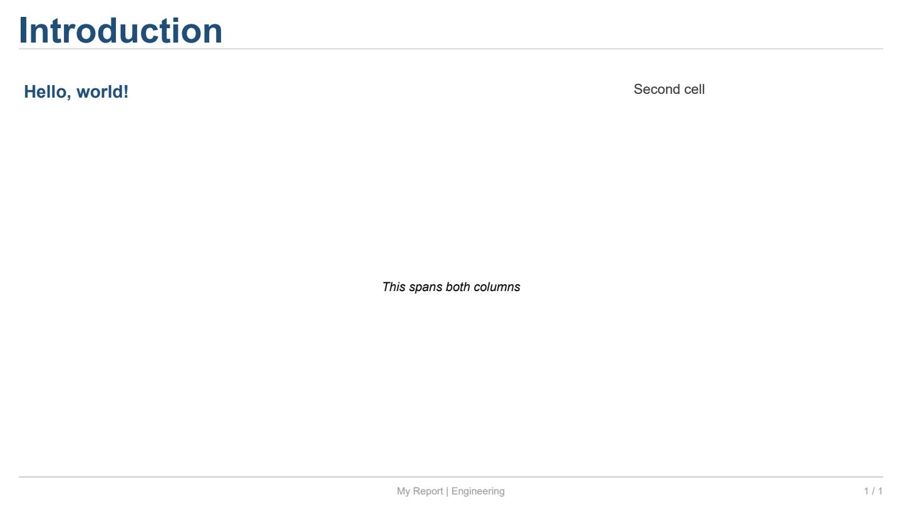

Documento, Slide, Grid y Renderizado
=====================================

Este ejemplo recorre el flujo completo de creación de un informe:
crear un :class:`~reporting.document.Document`, añadir un
:class:`~reporting.slide.Slide` con título, definir
una cuadrícula con :meth:`~reporting.slide.Slide.grid_layout`,
colocar texto en las celdas y renderizar a PDF y HTML.

Código completo
---------------

.. literalinclude:: ../../examples/docs_basic.py
   :language: python
   :caption: ``examples/docs_basic.py``

Explicación línea a línea
-------------------------

**Importaciones**

.. code-block:: python

   from reporting.document import Document

``Document`` es el contenedor principal del informe. Almacena la lista
de diapositivas y los metadatos (título, autor).

.. code-block:: python

   from reporting.slide import Slide

``Slide`` representa una página individual.

.. code-block:: python

   from reporting.layout.geometry import Edges

``Edges`` es una tupla ``(left, right, top, bottom)`` usada para
especificar padding y margin. Incluye métodos auxiliares
:meth:`~reporting.layout.geometry.Edges.all` y
:meth:`~reporting.layout.geometry.Edges.symmetric`.

.. code-block:: python

   from reporting.renderers.pdf.renderer import PDFRenderer

Renderizador que genera un archivo PDF mediante ReportLab con
posicionamiento absoluto de cada elemento.

.. code-block:: python

   from reporting.renderers.html.renderer import HTMLRenderer

Renderizador que genera un archivo HTML5 + CSS autónomo (sin
dependencias externas en el navegador).

---

**Crear el Documento**

.. code-block:: python

   doc = Document("My Report", author="Engineer")

.. list-table:: Parámetros de ``Document``
   :header-rows: 1
   :widths: 20 12 68

   * - Atributo
     - Tipo
     - Descripción
   * - ``title``
     - ``str``
     - Título del informe. Se usa como metadato en el PDF (``/Title``)
       y como ``<title>`` en el HTML.
   * - ``author``
     - ``str``
     - Nombre del autor (metadato).

---

**Crear una diapositiva**

.. code-block:: python

   slide = Slide()
   slide.title = "Introduction"
   slide.subtitle = "Getting started"

Para crear desde el documento:

.. code-block:: python

   slide = doc.new_slide()
   slide.title = "Introduction"

---

**Grid layout**

.. code-block:: python

   slide.grid_layout(rows=2, cols=2, gap=10, padding=Edges.all(20))

Define una cuadrícula de 2×2 en el área de contenido.

.. list-table:: Parámetros de ``grid_layout``
   :header-rows: 1
   :widths: 18 30 52

   * - Atributo
     - Tipo
     - Descripción
   * - ``rows``
     - ``int``
     - Número de filas.
   * - ``cols``
     - ``int``
     - Número de columnas.
   * - ``gap``
     - ``float``
     - Espacio entre celdas en píxeles (por defecto 0).
   * - ``padding``
     - ``Edges``
     - Margen exterior del grid en píxeles (por defecto 0).
   * - ``row_sizes``
     - ``list[float | Fill | Px | Percent]``
     - Tamaños individuales por fila. Cada valor puede ser un
       ``float`` (fracción del espacio disponible), ``Fill(n)``
       (ídem, más explícito), ``Px(n)`` (píxeles fijos) o
       ``Percent(n)`` (porcentaje del total).
   * - ``col_sizes``
     - *igual*
     - Tamaños individuales por columna.

**Edges**

.. code-block:: python

   from reporting.layout.geometry import Edges

   Edges.all(20)                        # left=right=top=bottom=20
   Edges.symmetric(h=20, v=10)          # left=right=20, top=bottom=10
   Edges(left=30, right=10, top=5, bottom=5)  # valores individuales

``Edges`` se usa tanto para ``padding`` en ``grid_layout`` como para
``margin`` y ``padding`` en :class:`~reporting.layout.panel.Panel`.

Ver :doc:`03_layouts` para más detalles sobre tamaños de fila/columna
y el modelo de caja (padding, margin, gap).

---

**Añadir contenido a las celdas**

.. code-block:: python

   slide[0, 0].text("Hello, world!", bold=True, size=14, color="#1F4E79")
   slide[0, 1].text("Second cell", size=11, color="#333333", alignment="center")
   slide[1, :].text("This spans both columns", italic=True, size=10, alignment="center")

**Acceso a celdas** (notación tipo NumPy):

.. list-table:: Modos de acceso a celdas
   :header-rows: 1
   :widths: 28 72

   * - Expresión
     - Significado
   * - ``slide[r, c]``
     - Celda individual en fila ``r``, columna ``c``.
   * - ``slide[r, :]``
     - Toda la fila ``r`` (colspan = número de columnas).
   * - ``slide[:, c]``
     - Toda la columna ``c`` (rowspan = número de filas).
   * - ``slide[r1:r2, c1:c2]``
     - Sub-grid: ocupa varias filas y columnas (rowspan × colspan).

Los slices calculan automáticamente ``colspan`` y ``rowspan``.

**Método .text()**

Crea un :class:`~reporting.elements.text.TextElement`.

.. list-table:: Argumentos de ``.text()``
   :header-rows: 1
   :widths: 16 14 70

   * - Argumento
     - Tipo
     - Descripción
   * - ``content``
     - ``str``
     - Texto a mostrar.
   * - ``bold``
     - ``bool``
     - Negrita (``False``).
   * - ``italic``
     - ``bool``
     - Cursiva (``False``).
   * - ``size``
     - ``float``
     - Tamaño en puntos (por defecto el del tema, normalmente 12 pt).
   * - ``color``
     - ``str``
     - Color en formato ``"#RRGGBB"``, ``"rgb(r,g,b)"`` o nombre CSS
       (ej. ``"red"``, ``"navy"``).
   * - ``alignment``
     - ``TextAlignment``
     - Alineación: ``LEFT``, ``CENTER``, ``RIGHT``.
   * - ``font_name``
     - ``str``
     - Familia tipográfica (ej. ``"Arial"``, ``"Times-Roman"``,
       ``"Courier"``).
   * - ``style``
     - ``str``
     - Clave en el tema: ``"h1"``, ``"h2"``, ``"h3"``, ``"body"``,
       ``"caption"``, ``"code"``. Hereda todas las propiedades del
       tema; los kwargs explícitos sobreescriben.

Ejemplos de ``style``:

.. code-block:: python

   slide[0, 0].text("Heading 1", style="h1")
   slide[0, 1].text("Body text", style="body", color="#CC0000")
   slide[1, 0].text("Caption", style="caption")

Para más tipos de elemento (figuras matplotlib, imágenes, tablas,
contenedores) ver :doc:`02_elements`.

---

**Añadir la diapositiva al documento**

.. code-block:: python

   doc.add_slide(slide)

``add_slide(slide: Slide) -> None`` — añade la diapositiva al final
del documento.

---

**Renderizar a PDF**

.. code-block:: python

   PDFRenderer().render_document(doc, "docs_basic.pdf")

:meth:`~reporting.renderers.base.Renderer.render_document`
toma el documento y una ruta de salida, y genera el archivo PDF.

El renderizador PDF utiliza ReportLab con posicionamiento absoluto:
cada elemento se coloca en coordenadas (x, y) calculadas a partir del
grid, respetando padding, gap y márgenes.

---

**Renderizar a HTML**

.. code-block:: python

   HTMLRenderer().render_document(doc, "docs_basic.html")

El renderizador HTML produce un documento HTML5 autónomo con CSS
embebido. El layout usa contenedores ``<div>`` con ``flex`` y
posicionamiento absoluto. Cada elemento se traduce a HTML semántico
(``<p>``, ````, ``<table>``, ``<figure>``) con estilos en línea.

---

Salida del ejemplo
------------------

La primera página del PDF generado se ve así:


