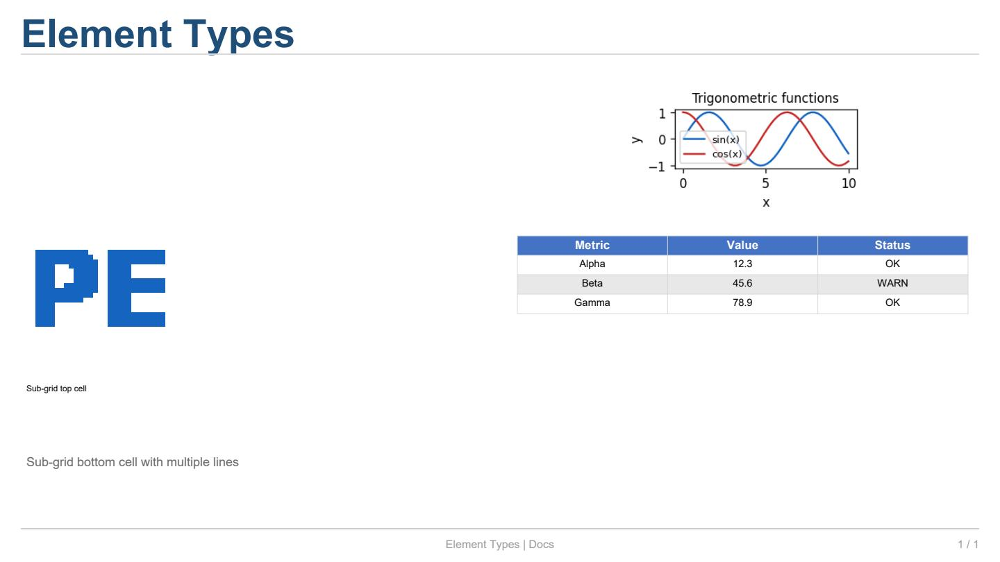

Tipos de Elemento
=================

``pyreportengine`` proporciona cinco tipos de elemento listos para
usar: texto, figuras (matplotlib), imágenes, tablas y contenedores
(sub-cuadrículas). Todos heredan de
:class:`~reporting.elements.base.BaseElement` y son **agnósticos del
backend** — no saben si serán renderizados a PDF o HTML.

Código completo
---------------

.. literalinclude:: ../../examples/docs_elements.py
   :language: python
   :caption: ``examples/docs_elements.py``

Explicación
-----------

**TextElement**

Un :class:`~reporting.elements.text.TextElement` representa uno o
varios párrafos de texto enriquecido. Cada párrafo es un
:class:`~reporting.elements.text.TextBlock` que contiene uno o más
:class:`~reporting.elements.text.TextRun` con formato uniforme.

.. code-block:: python

   te = slide[0, 0].text("Text with style", style="h1")
   te.add_run(" and mixed-format: ")
   te.add_run("bold", bold=True)
   te.add_run(", ")
   te.add_run("italic", italic=True)
   te.add_run(", ")
   te.add_run("colored", color="#C62828")

El método :meth:`~reporting.slide._CellProxy.text` crea un
``TextElement`` con un solo bloque y un solo run. Para texto con
formato mixto, se usa ``add_run()`` para añadir runs al bloque
actual y ``add_block()`` para empezar un nuevo párrafo.

.. list-table:: Métodos de ``TextElement``
   :header-rows: 1
   :widths: 18 18 64

   * - Método
     - Retorna
     - Descripción
   * - ``add_run(text, bold, italic, color, size, font_name)``
     - ``TextRun``
     - Añade un run al último bloque. Crea un bloque si no existe.
   * - ``add_block(alignment, spacing_before, spacing_after)``
     - ``TextBlock``
     - Crea un nuevo párrafo vacío. Los siguientes ``add_run`` se
       añadirán a este bloque.

.. list-table:: Atributos de ``TextRun``
   :header-rows: 1
   :widths: 16 14 70

   * - Atributo
     - Tipo
     - Descripción
   * - ``text``
     - ``str``
     - Contenido textual del run.
   * - ``bold``
     - ``bool``
     - Negrita (por defecto ``False``).
   * - ``italic``
     - ``bool``
     - Cursiva (por defecto ``False``).
   * - ``underline``
     - ``bool``
     - Subrayado (por defecto ``False``).
   * - ``color``
     - ``Optional[ColorValue]``
     - Color del texto (``None`` = hereda).
   * - ``size``
     - ``Optional[float]``
     - Tamaño en puntos (``None`` = hereda).
   * - ``font_name``
     - ``Optional[str]``
     - Familia tipográfica (``None`` = hereda).

.. list-table:: Atributos de ``TextBlock``
   :header-rows: 1
   :widths: 22 14 64

   * - Atributo
     - Tipo
     - Descripción
   * - ``runs``
     - ``list[TextRun]``
     - Los runs que componen este párrafo.
   * - ``alignment``
     - ``TextAlignment``
     - Alineación horizontal: ``LEFT``, ``CENTER``, ``RIGHT``,
       ``JUSTIFY``.
   * - ``spacing_before``
     - ``float``
     - Espacio extra antes del párrafo (puntos).
   * - ``spacing_after``
     - ``float``
     - Espacio extra después del párrafo (puntos).

---

**FigureElement**

Un :class:`~reporting.elements.figure.FigureElement` envuelve una
figura de matplotlib para incrustarla en el informe.

.. code-block:: python

   import matplotlib.pyplot as plt
   import numpy as np

   fig, ax = plt.subplots(figsize=(3.5, 1.8))
   x = np.linspace(0, 10, 50)
   ax.plot(x, np.sin(x), label="sin(x)", color="#1565C0")
   ax.plot(x, np.cos(x), label="cos(x)", color="#C62828")
   ax.legend(fontsize=8)
   ax.set_title("Trigonometric functions", fontsize=10)
   fig.tight_layout()

   slide[0, 1].plot(fig, format="png", dpi=120, preserve_aspect=True)

.. list-table:: Argumentos de ``.plot()`` y ``FigureElement``
   :header-rows: 1
   :widths: 20 14 66

   * - Argumento
     - Tipo
     - Descripción
   * - ``figure``
     - ``Figure``
     - Instancia de ``matplotlib.figure.Figure``.
   * - ``format``
     - ``str``
     - Formato de salida: ``"png"`` (raster, por defecto),
       ``"pdf"`` (vector, requiere ``pdfrw``) o ``"svg"``
       (vector, requiere ``svgwrite``).
   * - ``dpi``
     - ``int``
     - Resolución para formatos raster (por defecto 150).
   * - ``bbox_inches``
     - ``Optional[str]``
     - Ajuste de bounding box (por defecto ``"tight"``).
   * - ``preserve_aspect``
     - ``bool``
     - Mantener la relación de aspecto al escalar
       (por defecto ``False`` = estirar).
   * - ``container_width_pct``
     - ``Optional[float]``
     - Ancho como porcentaje del contenedor
       (por defecto ``None`` = tamaño nativo).
   * - ``container_height_pct``
     - ``Optional[float]``
     - Alto como porcentaje del contenedor
       (por defecto ``None`` = tamaño nativo).

---

**ImageElement**

Un :class:`~reporting.elements.image.ImageElement` carga una imagen
desde un archivo (PNG o JPG).

.. code-block:: python

   slide[1, 0].image("logo.png", scale=1.5)

.. list-table:: Argumentos de ``.image()`` y ``ImageElement``
   :header-rows: 1
   :widths: 16 14 70

   * - Argumento
     - Tipo
     - Descripción
   * - ``source``
     - ``str``
     - Ruta al archivo de imagen. La extensión determina el
       formato (``.png``, ``.jpg``/``.jpeg``, ``.svg``).
   * - ``scale``
     - ``float``
     - Factor de escala uniforme (por defecto 1.0).
   * - ``fit_mode``
     - ``ImageFitMode``
     - Modo de ajuste: ``ORIGINAL`` (tamaño nativo, reduce si
       excede el contenedor), ``FIT_VERTICAL`` (rellena alto),
       ``FIT_HORIZONTAL`` (rellena ancho).
   * - ``width``
     - ``Optional[float]``
     - Ancho explícito en puntos. Sobreescribe ``scale`` y
       ``fit_mode``.
   * - ``height``
     - ``Optional[float]``
     - Alto explícito en puntos. Sobreescribe ``scale`` y
       ``fit_mode``.
   * - ``rotation``
     - ``float``
     - Rotación en grados horaria (por defecto 0.0).
   * - ``opacity``
     - ``float``
     - Opacidad de 0.0 (transparente) a 1.0 (opaco).
   * - ``alt_text``
     - ``str``
     - Texto alternativo para accesibilidad.

**Prioridad de tamaño** (de mayor a menor):

1. ``width`` / ``height`` explícitos
2. ``fit_mode`` (``FIT_VERTICAL`` / ``FIT_HORIZONTAL``)
3. ``scale`` aplicado al tamaño nativo
4. ``ORIGINAL`` — tamaño nativo, reduce solo si excede el contenedor

---

**TableElement**

Un :class:`~reporting.elements.table.TableElement` crea una tabla a
partir de un ``pandas.DataFrame``.

.. code-block:: python

   import pandas as pd

   df = pd.DataFrame({
       "Metric": ["Alpha", "Beta", "Gamma"],
       "Value": [12.3, 45.6, 78.9],
       "Status": ["OK", "WARN", "OK"],
   })
   slide[1, 1].table(df, zebra=True, include_index=False)

   # Formato condicional
   el = slide[2, 0].table(df)
   el.highlight_max("Value")
   el.heatmap("Value", color_map="YlOrRd")

.. list-table:: Argumentos de ``.table()`` y ``TableElement``
   :header-rows: 1
   :widths: 20 14 66

   * - Argumento
     - Tipo
     - Descripción
   * - ``data``
     - ``DataFrame``
     - Un ``pandas.DataFrame`` con los datos.
   * - ``include_index``
     - ``bool``
     - Mostrar la columna de índice del DataFrame
       (por defecto ``False``).
   * - ``header``
     - ``bool``
     - Mostrar fila de cabecera (por defecto ``True``).
   * - ``zebra``
     - ``bool``
     - Colores alternos en filas (por defecto ``False``).
   * - ``numeric_format``
     - ``Optional[str]``
     - Formato para valores numéricos, ej. ``"{:.2f}"``
       (por defecto ``None``).
   * - ``column_widths``
     - ``Optional[list[float]]``
     - Anchos por columna en puntos (por defecto ``None`` =
       distribución equitativa).

.. list-table:: Métodos de formato condicional
   :header-rows: 1
   :widths: 28 18 54

   * - Método
     - Retorna
     - Descripción
   * - ``highlight_max(column)``
     - ``TableElement``
     - Resalta el valor máximo en la columna.
   * - ``highlight_min(column)``
     - ``TableElement``
     - Resalta el valor mínimo en la columna.
   * - ``heatmap(column, color_map)``
     - ``TableElement``
     - Aplica un gradiente de color tipo heatmap. ``color_map``
       es un nombre de colormap de matplotlib (ej. ``"YlOrRd"``).

También puedes usar :class:`~reporting.tablespec.spec.TableSpec`
para tablas con control total sobre celdas individuales, colspan,
rowspan y estilos. Ver :doc:`05_tables` para más detalles.

``.table()`` detecta automáticamente si el argumento ``data`` es un
``DataFrame`` o un ``TableSpec``:

.. code-block:: python

   from reporting.tablespec import TableSpec, Column

   ts = TableSpec(columns=[Column("x"), Column("y")])
   ts.row(1, 2).row(3, 4)
   slide[0, 0].table(ts)  # automático

---

**ContainerElement**

Un :class:`~reporting.elements.container.ContainerElement` permite
anidar una cuadrícula dentro de una celda, creando sub-layouts.

Se usa el método :meth:`~reporting.slide._CellProxy.grid_layout` que
toma un :class:`~reporting.layout.grid.Grid` y lo envuelve en un
:class:`~reporting.elements.container.ContainerElement`
automáticamente.

.. code-block:: python

   from reporting.layout.grid import Grid
   from reporting.elements.text import TextElement

   inner = Grid(rows=2, cols=1, gap=6)
   inner[0, 0].element = TextElement("Sub-grid top cell", style="body")
   inner[1, 0].element = TextElement(
       "Sub-grid bottom cell with\nmultiple lines",
       size=9, color="#666666",
   )
   slide[2, :].grid_layout(inner)

.. list-table:: Método ``.grid_layout()``
   :header-rows: 1
   :widths: 26 18 56

   * - Método
     - Retorna
     - Descripción
   * - ``.grid_layout(grid)``
     - ``ContainerElement``
     - Envuelve una ``Grid`` en un ``ContainerElement`` y la
       coloca en la celda.

.. list-table:: Atributos de ``ContainerElement``
   :header-rows: 1
   :widths: 14 14 72

   * - Atributo
     - Tipo
     - Descripción
   * - ``grid``
     - ``Grid``
     - La cuadrícula interna que contiene los elementos anidados.

**SpacerElement**

Un :class:`~reporting.elements.spacer.SpacerElement` es un elemento
invisible que reserva espacio en el layout. Útil para crear filas o
columnas en blanco.

.. code-block:: python

   from reporting.elements.spacer import SpacerElement

   spacer = SpacerElement(width=20, height=10)

.. list-table:: Atributos de ``SpacerElement``
   :header-rows: 1
   :widths: 14 14 72

   * - Atributo
     - Tipo
     - Descripción
   * - ``width``
     - ``float``
     - Espacio horizontal en puntos (por defecto 0.0).
   * - ``height``
     - ``float``
     - Espacio vertical en puntos (por defecto 0.0).

---

**Alineación de celda**

Antes de crear un elemento, se puede ajustar la alineación del
contenido dentro de la celda con
:meth:`~reporting.slide._CellProxy.align`:

.. code-block:: python

   from reporting.layout.panel import HAlign, VAlign

   slide[0, 0].align(HAlign.CENTER, VAlign.MIDDLE).text("Centered")
   slide[1, 0].align(HAlign.LEFT, VAlign.TOP).image("img.png")

.. list-table:: Opciones de ``HAlign``
   :header-rows: 1
   :widths: 28 72

   * - Valor
     - Descripción
   * - ``HAlign.LEFT``
     - Alinea el contenido a la izquierda.
   * - ``HAlign.CENTER``
     - Centra horizontalmente.
   * - ``HAlign.RIGHT``
     - Alinea a la derecha.
   * - ``HAlign.STRETCH``
     - Estira el contenido para llenar el ancho (por defecto).

.. list-table:: Opciones de ``VAlign``
   :header-rows: 1
   :widths: 28 72

   * - Valor
     - Descripción
   * - ``VAlign.TOP``
     - Alinea al borde superior.
   * - ``VAlign.MIDDLE``
     - Centra verticalmente.
   * - ``VAlign.BOTTOM``
     - Alinea al borde inferior.
   * - ``VAlign.STRETCH``
     - Estira el contenido para llenar el alto (por defecto).

---

Salida del ejemplo
------------------

La primera página del PDF generado se ve así:

