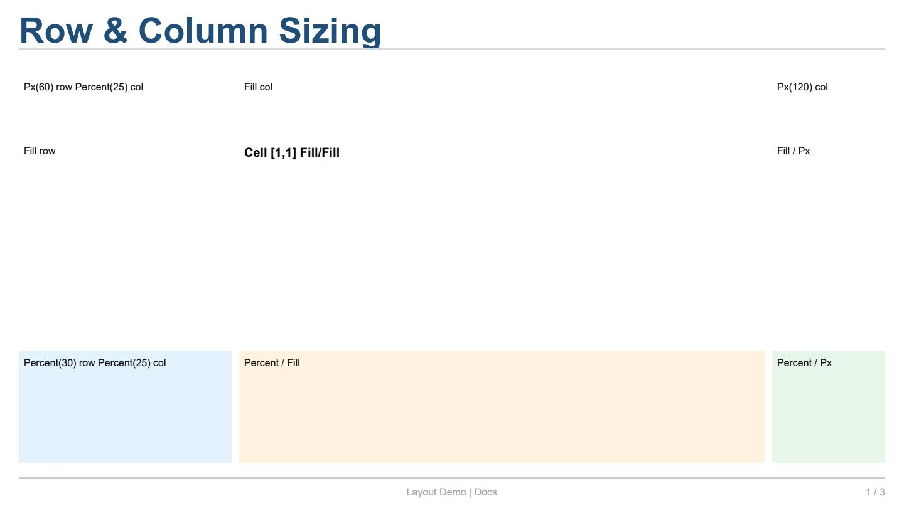
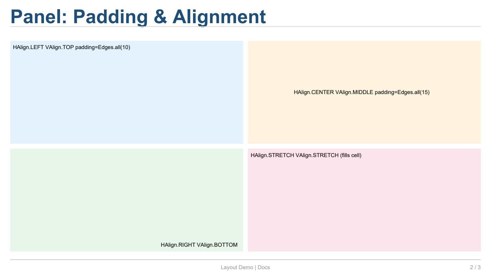
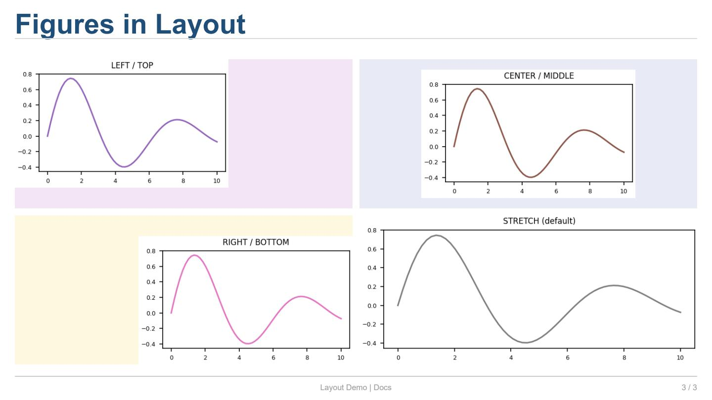

Layout: Grid, Panel, Sizing y Alignment
========================================

Este ejemplo cubre el sistema de layout: cómo se dimensionan las
filas y columnas (``Fill``, ``Px``, ``Percent``), cómo funcionan
el ``gap`` y ``padding`` del grid, y cómo se controla la
presentación dentro de cada celda (``Panel`` con ``padding``,
``margin``, ``background_color``, ``HAlign``, ``VAlign``).

Código completo
---------------

.. literalinclude:: ../../examples/docs_layouts.py
   :language: python
   :caption: ``examples/docs_layouts.py``

Explicación
-----------

**Grid: row_sizes y col_sizes**

``slide.grid_layout()`` acepta los parámetros ``row_sizes`` y
``col_sizes`` para controlar cómo se reparte el espacio disponible.

.. code-block:: python

   slide.grid_layout(
       rows=3, cols=3,
       row_sizes=[Px(60), Fill, Percent(30)],
       col_sizes=[Percent(25), Fill, Px(120)],
       gap=8, padding=Edges.all(20),
   )

.. list-table:: Parámetros de ``grid_layout``
   :header-rows: 1
   :widths: 16 28 56

   * - Parámetro
     - Tipo
     - Descripción
   * - ``rows``, ``cols``
     - ``int``
     - Número de filas y columnas.
   * - ``row_sizes``
     - ``list[Sizing]``
     - Tamaño de cada fila. Cada elemento puede ser:
       ``Px(n)`` (píxeles fijos), ``Percent(n)`` (porcentaje),
       ``Fill`` (rellena el espacio restante).
   * - ``col_sizes``
     - ``list[Sizing]``
     - Tamaño de cada columna (mismas opciones que
       ``row_sizes``).
   * - ``gap``
     - ``float``
     - Espacio entre celdas en píxeles (por defecto 0).
   * - ``padding``
     - ``Edges``
     - Margen exterior del grid (por defecto 0).

.. list-table:: Tipos de ``Sizing``
   :header-rows: 1
   :widths: 14 18 68

   * - Tipo
     - Sintaxis
     - Descripción
   * - ``Px(n)``
     - ``Px(120)``
     - Tamaño fijo de ``n`` puntos.
   * - ``Percent(n)``
     - ``Percent(25)``
     - ``n`` % del espacio disponible.
   * - ``Fill``
     - ``Fill``
     - Toma una fracción proporcional del espacio sobrante.
       Acepta un peso: ``Fill(2)`` ocupa el doble que ``Fill``.
   * - ``float``
     - ``120.0``
     - Atajo para ``Px(120)``.

Cuando no se especifican ``row_sizes`` o ``col_sizes``, todas las
filas/columnas obtienen ``Fill`` (igual tamaño).

---

**Edges: padding y margin**

``Edges`` se usa para especificar offsets en los cuatro lados.
Es un ``dataclass`` con campos ``left``, ``top``, ``right``,
``bottom``.

.. code-block:: python

   from reporting.layout.geometry import Edges

   Edges.all(10)                        # mismos 10 px en los 4 lados
   Edges.symmetric(h=15, v=8)           # left=right=15, top=bottom=8
   Edges(left=20, right=20, top=5, bottom=5)  # valores individuales

.. list-table:: Atributos y métodos de ``Edges``
   :header-rows: 1
   :widths: 28 18 54

   * - Atributo / Método
     - Tipo / Retorna
     - Descripción
   * - ``left``, ``right``, ``top``, ``bottom``
     - ``float``
     - Offset individual por lado (por defecto 0).
   * - ``horizontal``
     - ``float`` (propiedad)
     - Suma de ``left + right``.
   * - ``vertical``
     - ``float`` (propiedad)
     - Suma de ``top + bottom``.
   * - ``Edges.all(v)``
     - ``Edges``
     - Crea ``Edges(v, v, v, v)``.
   * - ``Edges.symmetric(h, v)``
     - ``Edges``
     - Crea ``Edges(h, v, h, v)``.

---

**Panel: contenido y decoración de cada celda**

Cada celda del grid tiene un :class:`~reporting.layout.panel.Panel`
que controla el padding interno, el margen externo, el color de
fondo, la alineación del contenido y más.

.. code-block:: python

   cell = slide2[0, 0]
   cell.background_color = "#E3F2FD"
   cell.padding = Edges.all(10)
   cell.align(HAlign.LEFT, VAlign.TOP)
   cell.text("HAlign.LEFT / VAlign.TOP", size=8)

.. list-table:: Atributos clave de ``Panel``
   :header-rows: 1
   :widths: 20 14 66

   * - Atributo
     - Tipo
     - Descripción
   * - ``padding``
     - ``Edges``
     - Espacio interno entre el borde de la celda y el
       contenido (por defecto 0).
   * - ``margin``
     - ``Edges``
     - Espacio externo alrededor de la celda
       (por defecto 0).
   * - ``background_color``
     - ``ColorValue``
     - Color de fondo (``None`` = transparente).
   * - ``border``
     - ``str``
     - Borde CSS (ej. ``"1px solid #CCC"``).
   * - ``border_radius``
     - ``float``
     - Radio de esquinas redondeadas (puntos).
   * - ``h_align``
     - ``HAlign``
     - Alineación horizontal del contenido.
   * - ``v_align``
     - ``VAlign``
     - Alineación vertical del contenido.
   * - ``min_size``
     - ``Size``
     - Tamaño mínimo (``Size(w, h)``).
   * - ``fixed_size``
     - ``Optional[Size]``
     - Tamaño fijo que sobreescribe el cálculo del grid.

El acceso al ``Panel`` de una celda se hace mediante
``slide[r, c]._cell.panel``, pero los atributos más comunes
tienen atajos directos en
:class:`~reporting.slide._CellProxy`:

.. list-table::
   :header-rows: 1
   :widths: 28 72

   * - Atajo
     - Equivalente
   * - ``cell.background_color``
     - ``cell._cell.panel.background_color``
   * - ``cell.padding``
     - ``cell._cell.panel.padding``
   * - ``cell.align(h, v)``
     - ``cell._cell.panel.h_align = h``
       ``cell._cell.panel.v_align = v``

El método :meth:`~reporting.slide._CellProxy.align` establece
``h_align`` y ``v_align`` directamente:

.. code-block:: python

   slide[0, 0].align(HAlign.CENTER, VAlign.MIDDLE).text("Centrado")

.. list-table:: Valores de ``HAlign``
   :header-rows: 1
   :widths: 24 76

   * - Valor
     - Descripción
   * - ``HAlign.LEFT``
     - Contenido pegado al borde izquierdo.
   * - ``HAlign.CENTER``
     - Contenido centrado horizontalmente.
   * - ``HAlign.RIGHT``
     - Contenido pegado al borde derecho.
   * - ``HAlign.STRETCH``
     - Contenido estirado para llenar todo el ancho
       (por defecto).

.. list-table:: Valores de ``VAlign``
   :header-rows: 1
   :widths: 24 76

   * - Valor
     - Descripción
   * - ``VAlign.TOP``
     - Contenido pegado al borde superior.
   * - ``VAlign.MIDDLE``
     - Contenido centrado verticalmente.
   * - ``VAlign.BOTTOM``
     - Contenido pegado al borde inferior.
   * - ``VAlign.STRETCH``
     - Contenido estirado para llenar todo el alto
       (por defecto).

---

**Figure: .plot() y el layout**

Los gráficos de matplotlib se insertan con
:meth:`~reporting.slide._CellProxy.plot` y respetan las mismas
reglas de panel que el texto:

.. code-block:: python

   cell = slide3[0, 0]
   cell.background_color = "#F3E5F5"
   cell.align(HAlign.LEFT, VAlign.TOP)
   cell.plot(_fig("LEFT / TOP", "C4"))
   cell.padding = Edges.all(8)

Cuando ``HAlign.STRETCH`` y ``VAlign.STRETCH`` (valores por
defecto), la figura se escala para llenar toda el área disponible
(menos padding). Con alineaciones ``LEFT``, ``CENTER``, ``TOP``,
etc., la figura conserva su tamaño intrínseco y se posiciona
según la alineación.

---

**Diagrama del modelo de caja**

Cada celda sigue este modelo (de fuera hacia dentro)::

    ┌────────────────────────────────────┐
    │   Grid padding (exterior)          │
    │   ┌────────────────────────────┐   │
    │   │  Gap (entre celdas)        │   │
    │   │  ┌──────────────────────┐  │   │
    │   │  │  Panel.margin        │  │   │
    │   │  │  ┌────────────────┐  │  │   │
    │   │  │  │ Panel.padding  │  │  │   │
    │   │  │  │ ┌────────────┐ │  │  │   │
    │   │  │  │ │ Contenido  │ │  │  │   │
    │   │  │  │ └────────────┘ │  │  │   │
    │   │  │  └────────────────┘  │  │   │
    │   │  └──────────────────────┘  │   │
    │   └────────────────────────────┘   │
    └────────────────────────────────────┘

En la práctica, el ``margin`` del panel rara vez se usa porque el
``gap`` del grid y el ``padding`` del panel cubren la mayoría de
las necesidades.

---

Salida del ejemplo
------------------

Primera página (sizing de filas y columnas):

Segunda página (padding y alignment):

Tercera página (figures en layout):

