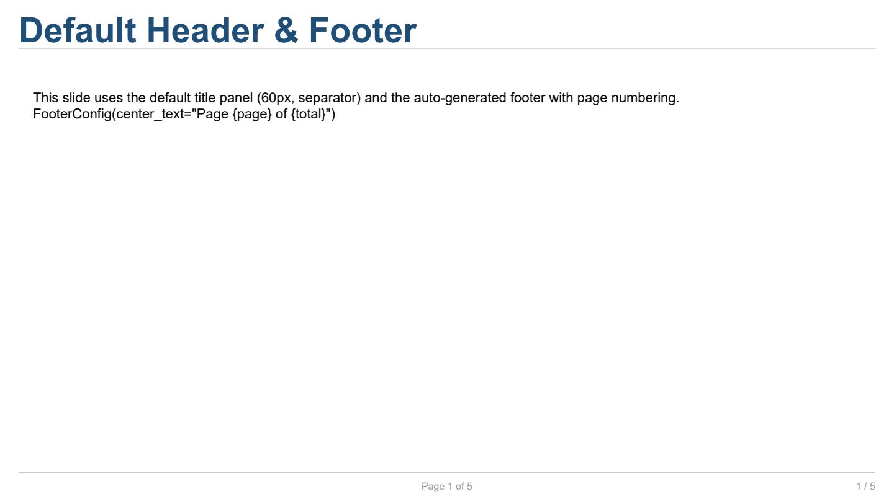
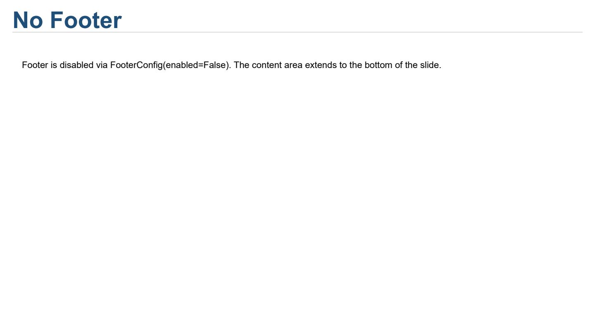
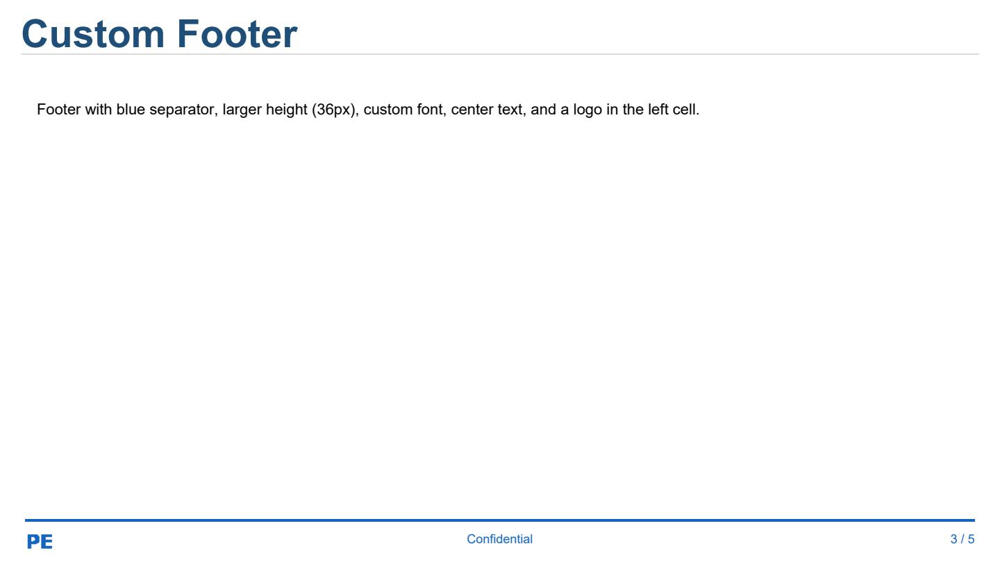
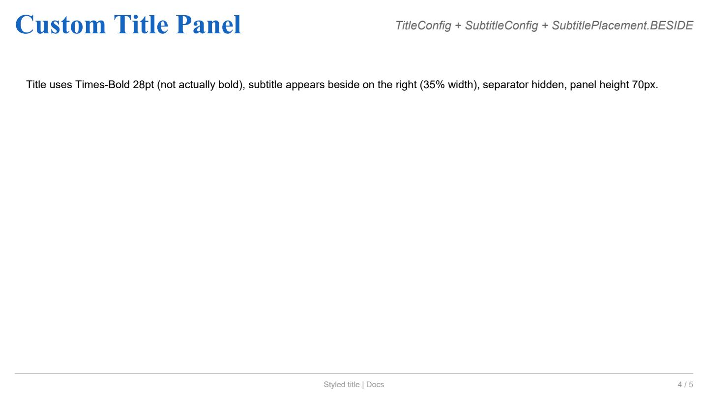
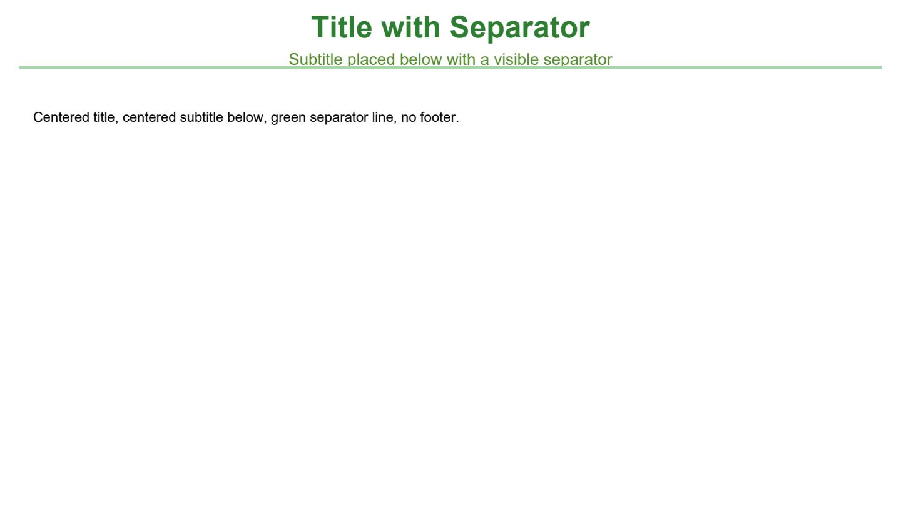

Title Panel and Footer
======================

Este ejemplo cubre la configuración del panel de título y el pie
de página automático.

Código completo
---------------

.. literalinclude:: ../../examples/docs_header_footer.py
   :language: python
   :caption: ``examples/docs_header_footer.py``

Explicación
-----------

**FooterConfig**

El pie de página se genera automáticamente en cada
:class:`~reporting.slide.Slide`. Se controla mediante
:class:`~reporting.footer_config.FooterConfig`:

.. code-block:: python

   from reporting.footer_config import FooterConfig

   slide = Slide(
       "Title",
       footer_config=FooterConfig(
           height=36,
           separator_color="#1565C0",
           separator_width=2,
           font_size=9,
           color="#1565C0",
           center_text="Confidential",
           padding=Edges(left=24, right=24, top=6, bottom=6),
       ),
   )

.. list-table:: Campos de ``FooterConfig``
   :header-rows: 1
   :widths: 18 14 68

   * - Campo
     - Tipo
     - Descripción
   * - ``height``
     - ``float``
     - Alto del pie en píxeles (por defecto 28.0).
   * - ``show_separator``
     - ``bool``
     - Dibujar una línea sobre el pie (por defecto ``True``).
   * - ``separator_color``
     - ``ColorValue``
     - Color de la línea (por defecto ``"#CCCCCC"``).
   * - ``separator_width``
     - ``float``
     - Grosor de la línea en puntos (por defecto 1.0).
   * - ``font_name``, ``font_size``, ``color``
     - ``str`` / ``float`` / ``ColorValue``
     - Fuente por defecto del texto del pie.
   * - ``padding``
     - ``Edges``
     - Relleno interior (por defecto ``Edges(20,4,20,4)``).
   * - ``enabled``
     - ``bool``
     - Activar o desactivar el pie (por defecto ``True``).
   * - ``center_text``
     - ``str``
     - Texto centrado. Acepta ``{page}`` y ``{total}``.

El parámetro ``footer_logo`` acepta una ruta a una imagen que se
coloca en la celda izquierda del pie.

Para desactivar el pie:

.. code-block:: python

   slide = Slide("Title", footer_config=FooterConfig(enabled=False))

---

**TitleConfig, SubtitleConfig y TitlePanelConfig**

El panel de título se personaliza mediante tres clases:

.. code-block:: python

   from reporting.title_config import (
       TitleConfig, SubtitleConfig, TitlePanelConfig,
       SubtitlePlacement,
   )

   slide = Slide(
       "Custom Title Panel",
       subtitle="Beside placement",
       title_config=TitleConfig(
           font_name="Times-Bold",
           font_size=28,
           color="#1565C0",
           alignment=TextAlignment.CENTER,
           show_separator=False,
       ),
       subtitle_config=SubtitleConfig(
           font_size=12,
           italic=True,
           color="#666666",
           alignment=TextAlignment.RIGHT,
       ),
       title_panel_config=TitlePanelConfig(
           subtitle_placement=SubtitlePlacement.BESIDE,
           subtitle_width_ratio=0.35,
       ),
       title_panel_height=70,
   )

.. list-table:: Campos de ``TitleConfig``
   :header-rows: 1
   :widths: 20 14 66

   * - Campo
     - Tipo
     - Descripción
   * - ``font_name``
     - ``str``
     - Familia tipográfica (por defecto ``"Helvetica"``).
   * - ``font_size``
     - ``float``
     - Tamaño en puntos (por defecto 20.0).
   * - ``bold``, ``italic``
     - ``bool``
     - Estilos (por defecto ``bold=True``).
   * - ``color``
     - ``ColorValue``
     - Color del texto (por defecto ``"#1F4E79"``).
   * - ``alignment``
     - ``TextAlignment``
     - ``LEFT``, ``CENTER`` o ``RIGHT``.
   * - ``show_separator``
     - ``bool``
     - Línea separadora bajo el título (por defecto ``True``).
   * - ``separator_color``, ``separator_width``
     - ``ColorValue`` / ``float``
     - Estilo de la línea separadora.

.. list-table:: Campos de ``SubtitleConfig``
   :header-rows: 1
   :widths: 16 14 70

   * - Campo
     - Tipo
     - Descripción
   * - ``font_name``
     - ``str``
     - Familia tipográfica (por defecto ``"Helvetica"``).
   * - ``font_size``
     - ``float``
     - Tamaño en puntos (por defecto 11.0).
   * - ``bold``, ``italic``
     - ``bool``
     - Estilos (por defecto ``False``).
   * - ``color``
     - ``ColorValue``
     - Color del texto (por defecto ``"#666666"``).
   * - ``alignment``
     - ``TextAlignment``
     - ``LEFT``, ``CENTER`` o ``RIGHT``.

.. list-table:: Campos de ``TitlePanelConfig``
   :header-rows: 1
   :widths: 24 14 62

   * - Campo
     - Tipo
     - Descripción
   * - ``subtitle_placement``
     - ``SubtitlePlacement``
     - ``BELOW`` (debajo) o ``BESIDE`` (al lado).
   * - ``subtitle_width_ratio``
     - ``float``
     - Fracción del ancho para el subtítulo en modo
       ``BESIDE`` (por defecto 0.35).
   * - ``padding``
     - ``Edges``
     - Relleno interior del panel.

.. list-table:: Valores de ``SubtitlePlacement``
   :header-rows: 1
   :widths: 24 76

   * - Valor
     - Descripción
   * - ``SubtitlePlacement.BELOW``
     - Subtítulo en una nueva línea bajo el título.
   * - ``SubtitlePlacement.BESIDE``
     - Subtítulo a la derecha del título, compartiendo fila.

---

**Placeholders dinámicos**

En el ``center_text`` del pie se pueden usar:

* ``{page}`` — número de página actual
* ``{total}`` — total de páginas

Se reemplazan en tiempo de renderizado.

---

**title_panel_height**

Controla el alto del panel de título en píxeles. Por defecto es
60 píxeles (o el valor definido en el ``slide_type`` del tema).

El área de contenido disponible se obtiene con
``slide.content_size``, que descuenta el alto del panel de título
y del pie.

---

**footer_logo**

El parámetro ``footer_logo`` acepta la ruta a un archivo de imagen
que se coloca automáticamente en la celda izquierda del pie:

.. code-block:: python

   slide = Slide("Title", footer_logo="path/to/logo.png")

Salida del ejemplo
------------------

