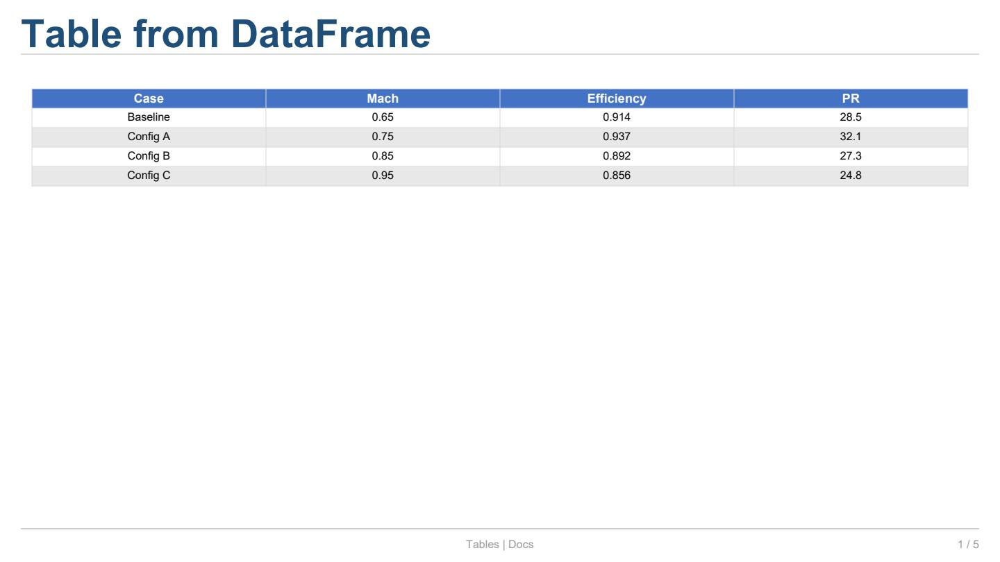
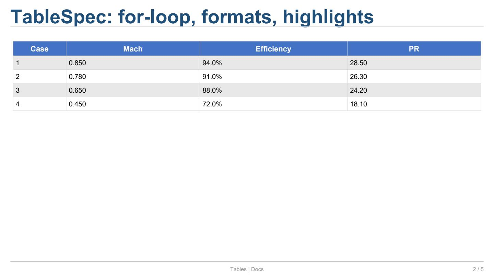
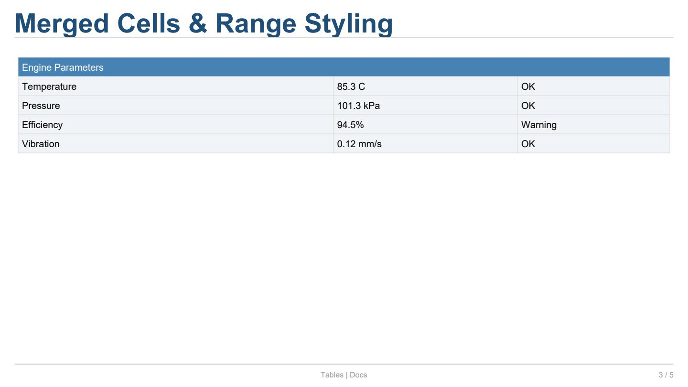
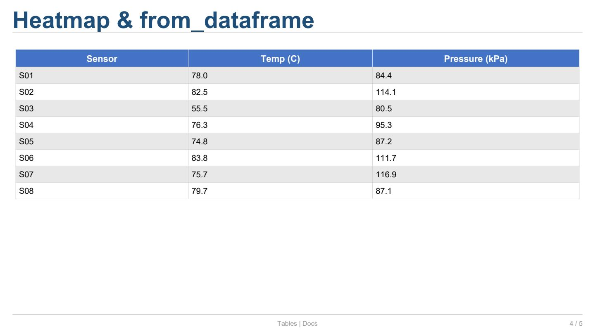
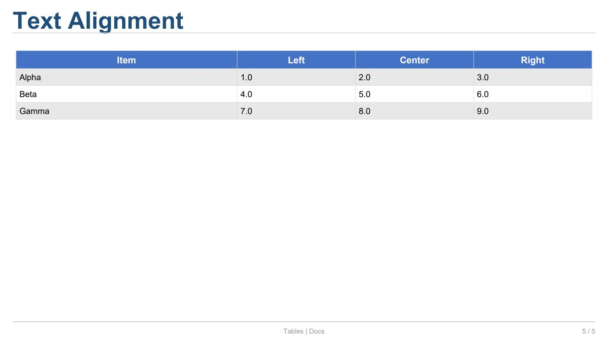

Tables (DataFrame & TableSpec)
===============================

Este ejemplo cubre la creación de tablas desde
:class:`pandas.DataFrame` y desde la API nativa
:class:`~reporting.tablespec.spec.TableSpec`.

Código completo
---------------

.. literalinclude:: ../../examples/docs_tables.py
   :language: python
   :caption: ``examples/docs_tables.py``

Explicación
-----------

**1. Tabla simple desde DataFrame**

.. code-block:: python

   slide[r, c].table(df, zebra=True, include_index=False)

El método :meth:`~reporting.slide._CellProxy.table` acepta un
:class:`pandas.DataFrame` y renderiza todas sus columnas.

.. list-table:: Parámetros de ``.table()``
   :header-rows: 1
   :widths: 20 14 66

   * - Parámetro
     - Tipo
     - Descripción
   * - ``df``
     - ``DataFrame``
     - Datos a mostrar.
   * - ``zebra``
     - ``bool``
     - Alternar color de fondo entre filas (por defecto
       ``False``).
   * - ``include_index``
     - ``bool``
     - Incluir el índice del DataFrame (por defecto
       ``True``).
   * - ``header_row``
     - ``bool``
     - Mostrar fila de encabezados (por defecto ``True``).

---

**2. TableSpec con for-loop, formatos y resaltes**

:class:`~reporting.tablespec.spec.TableSpec` ofrece control total
sobre el contenido, formato y estilo de cada celda.

.. code-block:: python

   from reporting.tablespec import TableSpec

   ts = TableSpec()
   ts.add_column("Case", format="{:.0f}")
   ts.add_column("Mach", format="{:.3f}")
   ts.add_column("Efficiency", format="{:.1%}")

   for i, (mach, eff, pr) in enumerate(rows, start=1):
       ts.add_row(i, mach, eff, pr)

   ts.highlight_max("Efficiency")
   ts.highlight_min("PR")
   ts.zebra()
   slide[r, c].table_spec(ts)

.. list-table:: Métodos principales de ``TableSpec``
   :header-rows: 1
   :widths: 28 72

   * - Método
     - Descripción
   * - ``add_column(name, format=...)``
     - Define una columna con formato opcional.
   * - ``add_row(*values)``
     - Añade una fila de datos.
   * - ``cell(row, col, value=..., colspan=..., ...)``
     - Accede/estila una celda individual (debe existir
       la fila).
   * - ``column(name)``
     - Retorna la :class:`~reporting.tablespec.column.Column`
       para aplicar ``set_format()``, ``set_formatter()``, etc.
   * - ``zebra()``
     - Alterna colores de fila.
   * - ``highlight_max(col)``
     - Resalta el valor máximo de una columna.
   * - ``highlight_min(col)``
     - Resalta el valor mínimo de una columna.
   * - ``heatmap(col)``
     - Mapa de calor en una columna numérica.
   * - ``range("A1:C5")``
     - Retorna un :class:`~reporting.tablespec.spec.RangeSelector`
       con métodos ``.style()`` y ``.merge()``.
   * - ``from_dataframe(df)``
     - Construye un ``TableSpec`` desde un DataFrame.
   * - ``from_records(records)``
     - Construye desde una lista de ``dict``.
   * - ``from_dataclasses(instances)``
     - Construye desde una lista de dataclasses.

---

**3. Celdas fusionadas con colspan**

Para crear una fila de encabezado fusionada que ocupe todas las
columnas, se desactiva el encabezado automático con
``header_rows=0`` y se usa ``cell()`` con ``colspan``:

.. code-block:: python

   ts3 = TableSpec(style=TableStyle(header_rows=0))
   ts3.add_row("Engine Parameters", "", "")
   ts3.cell(row=0, col=0, value="Engine Parameters", colspan=3,
            background_color="steelblue", text_color="white")

.. list-table:: Parámetros de ``cell()``
   :header-rows: 1
   :widths: 20 14 66

   * - Parámetro
     - Tipo
     - Descripción
   * - ``row``, ``col``
     - ``int``
     - Coordenadas de la celda.
   * - ``value``
     - ``Any``
     - Contenido de la celda.
   * - ``colspan``
     - ``int``
     - Número de columnas que ocupa (por defecto 1).
   * - ``rowspan``
     - ``int``
     - Número de filas que ocupa (por defecto 1).
   * - ``**kwargs``
     - ``CellStyle``
     - Atributos de estilo (``background_color``,
       ``text_color``, ``bold``, ``font_size``, etc.).

---

**4. Range styling con merge**

.. code-block:: python

   ts.range("A2:C5").style(background_color="#F0F4F8")

La notación ``"A1"`` (letra columna + número fila) permite
referenciar rangos al estilo Excel.

---

**5. Heatmap desde DataFrame**

.. code-block:: python

   ts4 = TableSpec.from_dataframe(df_sensors)
   ts4.column("Temp (C)").set_format("{:.1f}")
   ts4.heatmap("Temp (C)")

El método ``heatmap(col)`` aplica un degradado de color sobre
los valores de la columna, del más frío (verde/azul) al más
caliente (rojo). Combinado con ``zebra()`` y ``set_format()``
se obtienen tablas listas para informes técnicos.

---

**6. Alineación de texto**

Cada columna puede definir su alineación por defecto con
el parámetro ``alignment`` de
:meth:`~reporting.tablespec.spec.TableSpec.add_column`:

.. code-block:: python

   from reporting.elements.text import TextAlignment

   ts5 = TableSpec()
   ts5.add_column("Item")
   ts5.add_column("Left", alignment=TextAlignment.LEFT)
   ts5.add_column("Center", alignment=TextAlignment.CENTER)
   ts5.add_column("Right", alignment=TextAlignment.RIGHT)

También se puede aplicar por celda individual mediante
el parámetro ``alignment`` de
:meth:`~reporting.tablespec.spec.TableSpec.cell`:

.. code-block:: python

   ts.cell(row=2, col=1, alignment=TextAlignment.CENTER)

.. list-table:: Valores de ``TextAlignment``
   :header-rows: 1
   :widths: 20 80

   * - Valor
     - Descripción
   * - ``TextAlignment.LEFT``
     - Alineado a la izquierda (por defecto).
   * - ``TextAlignment.CENTER``
     - Centrado horizontalmente.
   * - ``TextAlignment.RIGHT``
     - Alineado a la derecha.
   * - ``TextAlignment.JUSTIFY``
     - Justificado (texto completo).

Salida del ejemplo
------------------

