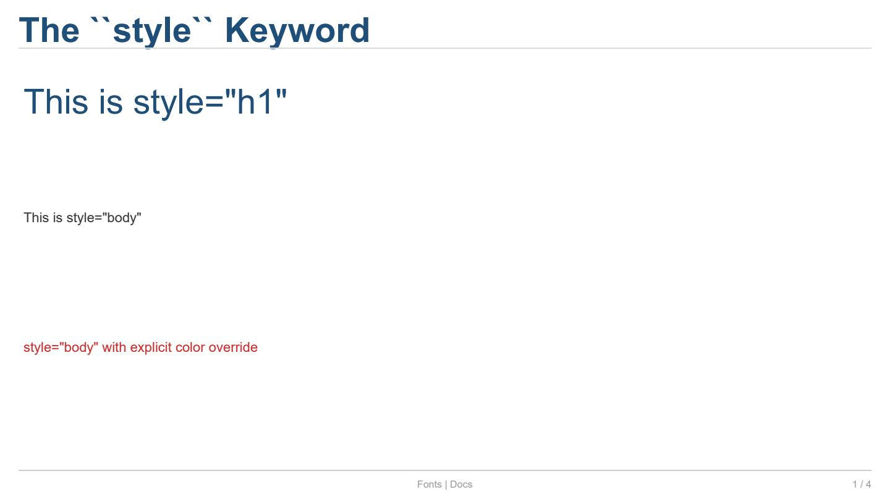
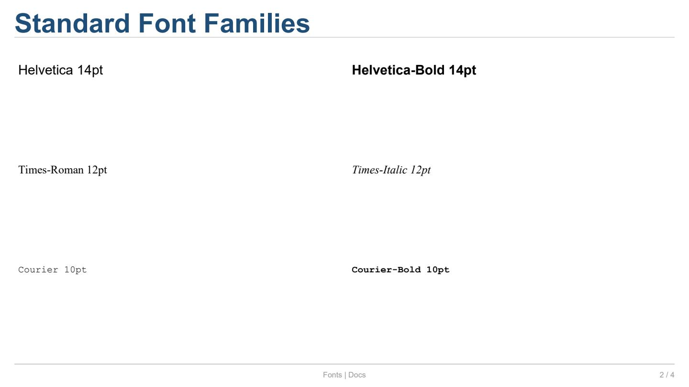
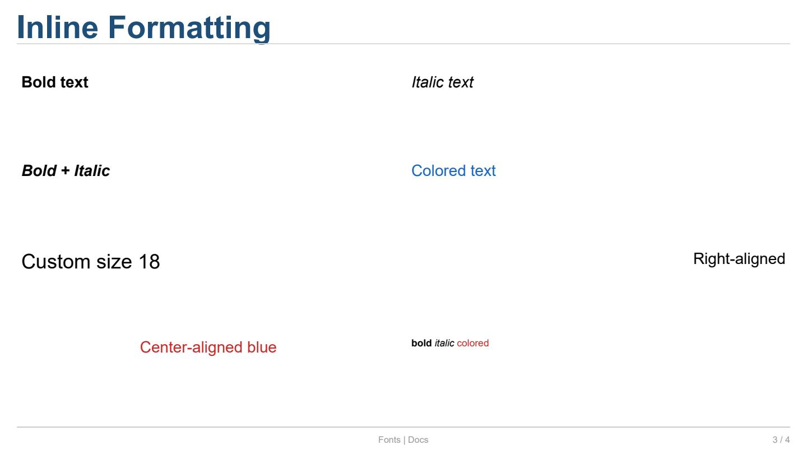
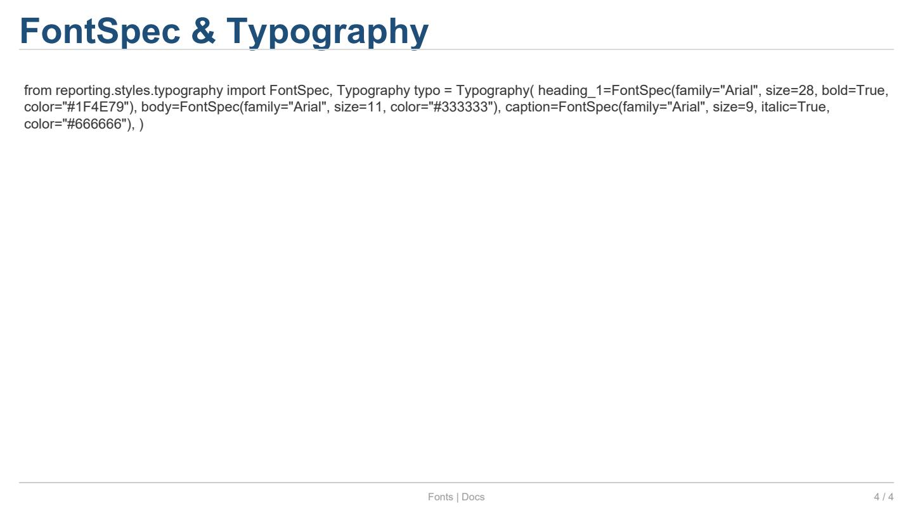

Font Usage
==========

Este ejemplo cubre cómo usar fuentes, el parámetro ``style``,
formatos inline (``bold``, ``italic``, ``color``), y el sistema
``Typography``.

Código completo
---------------

.. literalinclude:: ../../examples/docs_fonts.py
   :language: python
   :caption: ``examples/docs_fonts.py``

Explicación
-----------

**1. El keyword ``style``**

El método :meth:`~reporting.slide._CellProxy.text` acepta un
parámetro ``style`` que resuelve las propiedades de la fuente
desde la tipografía del tema:

.. code-block:: python

   slide[0, 0].text("This is style=\"h1\"", style="h1")
   slide[1, 0].text("This is style=\"body\"", style="body")

Valores disponibles: ``"h1"``, ``"h2"``, ``"h3"``, ``"heading_1"``,
``"heading_2"``, ``"heading_3"``, ``"body"``, ``"caption"``,
``"code"``, ``"mono"``.

Los kwargs explícitos (``color``, ``size``, ``bold``, etc.)
sobrescriben los valores resueltos del tema:

.. code-block:: python

   slide[2, 0].text("Red body", style="body", color="#C62828")

---

**2. font_name — familias estándar**

El parámetro ``font_name`` acepta cualquier nombre de fuente
PostScript. Las fuentes estándar de ReportLab son:

.. list-table:: Fuentes estándar
   :header-rows: 1
   :widths: 22 78

   * - Nombre
     - Descripción
   * - ``"Helvetica"``
     - Sans-serif (por defecto).
   * - ``"Helvetica-Bold"``
     - Sans-serif negrita.
   * - ``"Helvetica-Oblique"``
     - Sans-serif inclinada.
   * - ``"Times-Roman"``
     - Serif.
   * - ``"Times-Bold"``
     - Serif negrita.
   * - ``"Times-Italic"``
     - Serif cursiva.
   * - ``"Courier"``
     - Monoespaciada.
   * - ``"Courier-Bold"``
     - Monoespaciada negrita.
   * - ``"Courier-Oblique"``
     - Monoespaciada inclinada.

---

**3. Formatos inline con kwargs**

El método ``.text()`` acepta kwargs que se aplican al
:class:`~reporting.elements.text.TextRun` creado:

.. code-block:: python

   slide[0, 0].text("Bold", bold=True, size=14)
   slide[1, 0].text("Colored", color="#1565C0", size=14)
   slide[2, 0].text("Center-aligned", alignment="center", size=14)

.. list-table:: Kwargs de ``.text()``
   :header-rows: 1
   :widths: 14 14 72

   * - Kwarg
     - Tipo
     - Descripción
   * - ``bold``
     - ``bool``
     - Texto en negrita (por defecto ``False``).
   * - ``italic``
     - ``bool``
     - Texto en cursiva (por defecto ``False``).
   * - ``color``
     - ``ColorValue``
     - Color del texto.
   * - ``size``
     - ``float``
     - Tamaño en puntos.
   * - ``font_name``
     - ``str``
     - Familia tipográfica.
   * - ``alignment``
     - ``str`` o ``TextAlignment``
     - ``"left"``, ``"center"``, ``"right"``, ``"justify"``.

---

**4. TextRun mixto con add_run**

Para texto con formato mixto dentro de una misma celda:

.. code-block:: python

   te = slide[3, 1].text("", size=12)
   te.add_run("bold ", bold=True)
   te.add_run("italic ", italic=True)
   te.add_run("colored", color="#C62828")

Cada :meth:`~reporting.elements.text.TextElement.add_run`
crea un :class:`~reporting.elements.text.TextRun` con su
propio formato.

---

**5. FontSpec y Typography**

:class:`~reporting.styles.typography.FontSpec` define una fuente
(familia, tamaño, estilo, color). :class:`~reporting.styles.typography.Typography`
agrupa varias ``FontSpec`` para los distintos niveles textuales:

.. code-block:: python

   from reporting.styles.typography import FontSpec, Typography

   typo = Typography(
       heading_1=FontSpec(family="Arial", size=28, bold=True,
                          color="#1F4E79"),
       body=FontSpec(family="Arial", size=11, color="#333333"),
       caption=FontSpec(family="Arial", size=9, italic=True,
                        color="#666666"),
   )

Se usa al crear un tema personalizado (``Theme(typography=typo)``).

Salida del ejemplo
------------------

