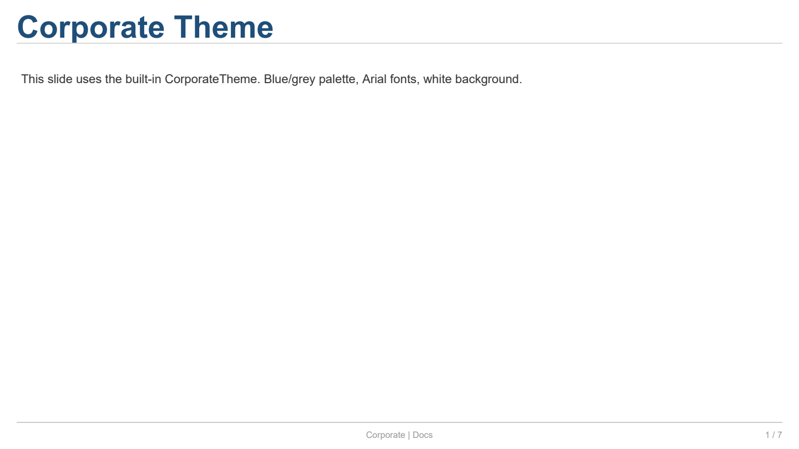
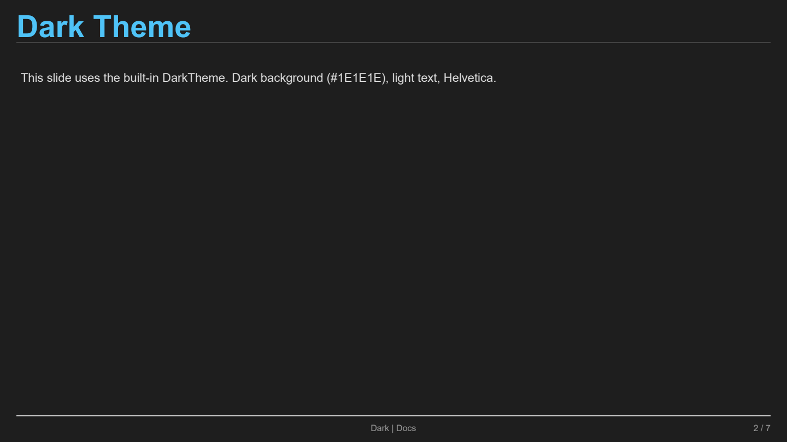
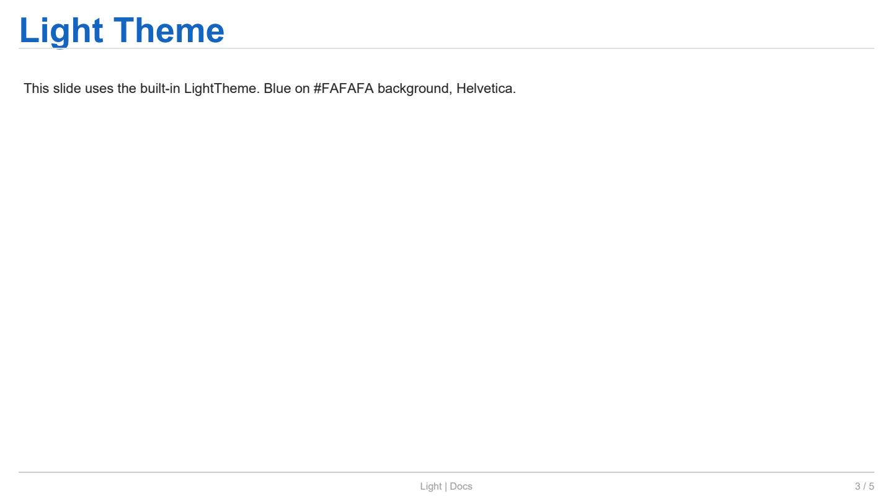

Themes (Built-in & Custom)
==========================

This page covers the built-in themes (``CorporateTheme``,
``DarkTheme``, ``LightTheme``) and how to create a custom theme.

Full example
------------

.. literalinclude:: ../../examples/docs_themes.py
   :language: python
   :caption: ``examples/docs_themes.py``

Explanation
-----------

**1. Built-in themes**

The framework ships with three ready-to-use themes:

.. code-block:: python

   from reporting.styles.theme import CorporateTheme, DarkTheme, LightTheme

   slide = Slide(theme=CorporateTheme())
   slide.title = "Title"

.. list-table:: Built-in themes
   :header-rows: 1
   :widths: 18 20 20 42

   * - Theme
     - Background
     - Typography
     - Palette
   * - ``CorporateTheme``
     - White
     - Arial
     - Corporate blue/grey
   * - ``DarkTheme``
     - ``#1E1E1E``
     - Helvetica
     - Light blue on dark
   * - ``LightTheme``
     - ``#FAFAFA``
     - Helvetica
     - Blue on light grey

---

**2. Theme components**

A :class:`~reporting.styles.theme.Theme` bundles colours and typography:

.. list-table:: ``Theme`` fields
   :header-rows: 1
   :widths: 18 18 64

   * - Field
     - Type
     - Description
   * - ``name``
     - ``str``
     - Theme identifier.
   * - ``palette``
     - ``ColorPalette``
     - Primary, secondary, accent, background,
       text, border, error, warning, success.
   * - ``typography``
     - ``Typography``
     - Font specs for headings (3 levels), body,
       caption, code, mono.

---

**3. Creating a custom theme**

A theme is created by constructing a ``Theme`` instance directly:

.. code-block:: python

   from reporting.styles.theme import Theme
   from reporting.styles.colors import ColorPalette, Color
   from reporting.styles.typography import Typography, FontSpec

   ocean_theme = Theme(
       name="Ocean",
       palette=ColorPalette(
           primary=Color.from_hex("#006994"),
           secondary=Color.from_hex("#00B4D8"),
           accent=Color.from_hex("#FF6B35"),
           background=Color.from_hex("#E0F7FA"),
           text_primary=Color.from_hex("#003B5C"),
           text_secondary=Color.from_hex("#0077B6"),
           border=Color.from_hex("#90E0EF"),
           error=Color.from_hex("#C00000"),
           warning=Color.from_hex("#FFC000"),
           success=Color.from_hex("#2E7D32"),
       ),
       typography=Typography(
           heading_1=FontSpec("Helvetica", 28, bold=True, color="#006994"),
           heading_2=FontSpec("Helvetica", 22, bold=True, color="#00B4D8"),
           body=FontSpec("Helvetica", 11, color="#003B5C"),
           caption=FontSpec("Helvetica", 9, italic=True, color="#0077B6"),
       ),
   )

Using the custom theme:

.. code-block:: python

   slide = Slide(theme=ocean_theme)
   slide.title = "Marine Life"

---

**4. Theme applied via Slide**

Every slide accepts an optional ``theme`` argument:

.. code-block:: python

   slide = Slide(theme=DarkTheme())
   slide.title = "Dark Slide"

When no theme is provided, ``CorporateTheme`` is used as default.

---

**5. Slide types (removed)**

Previous versions included ``SlideTypeConfig`` and ``LayoutConfig``
for pre-defined slide templates. These have been removed in favour
of the simpler property-based API. Set title, subtitle and grid
layout directly on each slide.

Example output
--------------

