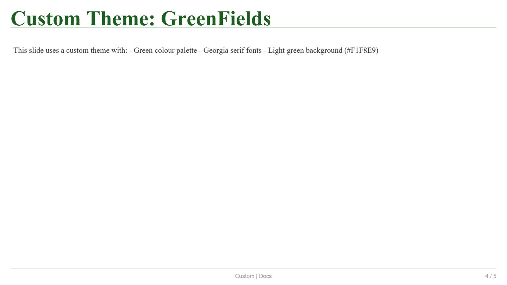
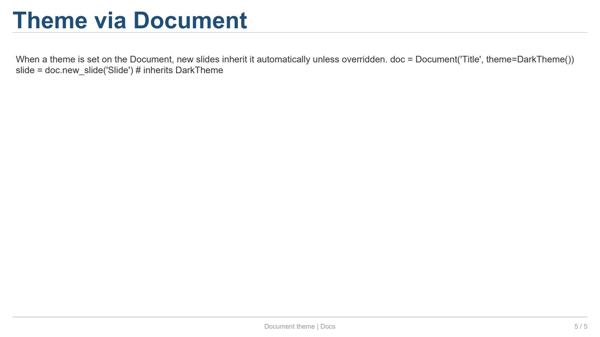
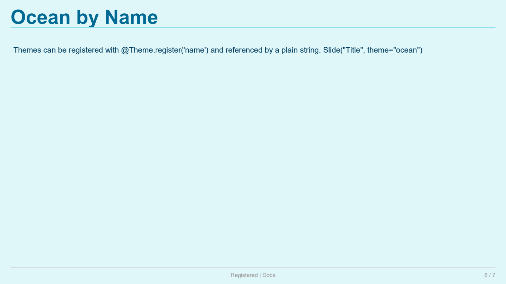
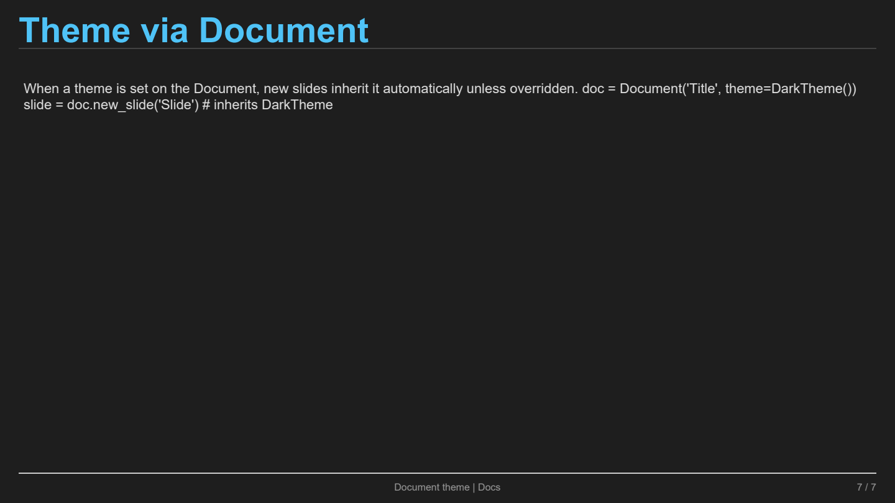

Themes (Built-in & Custom)
==========================

This page covers the built-in themes (``CorporateTheme``,
``DarkTheme``, ``LightTheme``), how to create a custom theme with
named layouts and slide types, and how to register them for
auto-discovery.

Full example
------------

.. literalinclude:: ../../examples/docs_themes.py
   :language: python
   :caption: ``examples/docs_themes.py``

Explanation
-----------

**1. Built-in themes**

The framework ships with three ready-to-use themes:

.. code-block:: python

   from reporting.styles.theme import CorporateTheme, DarkTheme, LightTheme

   slide = Slide("Title", theme=CorporateTheme())
   slide = Slide("Title", theme=DarkTheme())
   slide = Slide("Title", theme=LightTheme())

.. list-table:: Built-in themes
   :header-rows: 1
   :widths: 18 20 20 42

   * - Theme
     - Background
     - Typography
     - Palette
   * - ``CorporateTheme``
     - White
     - Arial
     - Corporate blue/grey
   * - ``DarkTheme``
     - ``#1E1E1E``
     - Helvetica
     - Light blue on dark
   * - ``LightTheme``
     - ``#FAFAFA``
     - Helvetica
     - Blue on light grey

---

**2. Theme components**

A :class:`~reporting.styles.theme.Theme` bundles the full visual identity:

.. list-table:: ``Theme`` fields
   :header-rows: 1
   :widths: 18 18 64

   * - Field
     - Type
     - Description
   * - ``name``
     - ``str``
     - Theme identifier.
   * - ``page_size``
     - ``tuple[float, float]``
     - Default slide size ``(width, height)`` in px
       (default ``(960, 540)``).
   * - ``palette``
     - ``ColorPalette``
     - Primary, secondary, accent, background,
       text, border, error, warning, success.
   * - ``typography``
     - ``Typography``
     - Font specs for headings (3 levels), body,
       caption, code, mono.
   * - ``table_style``
     - ``TableStyle``
     - Default table styling.
   * - ``layouts``
     - ``dict[str, LayoutConfig]``
     - Named grid layouts referenced by slide types.
   * - ``slide_types``
     - ``dict[str, SlideTypeConfig]``
     - Pre-defined slide templates.
   * - ``footer_panel``
     - ``FooterPanel``
     - Default footer configuration.

---

**3. LayoutConfig — named grid layouts**

:class:`~reporting.layout_config.LayoutConfig` defines a grid
layout that can be stored in a theme and reused by multiple
slide types:

.. code-block:: python

   from reporting.layout_config import LayoutConfig
   from reporting.layout.sizing import Px, Fill
   from reporting.layout.geometry import Edges

   # A 2×2 grid with fixed top row, flexible columns, 8px gap
   cfg = LayoutConfig(
       name="two_by_two",
       rows=2, cols=2, gap=8,
       row_sizes=[Px(100), Fill],   # top row 100px, bottom fills
       col_sizes=[Fill, Fill],       # both columns flexible
       padding=Edges.all(20),        # 20px outer padding
   )

``row_sizes`` and ``col_sizes`` accept ``Px(v)``,
``Percent(v)``, ``Fill``, or a plain ``float`` (treated as
``Px(v)``).  When ``None``, all rows/columns use ``Fill``.

---

**4. SlideTypeConfig — slide templates**

:class:`~reporting.slide_type.SlideTypeConfig` bundles default
content and layout for a category of slide:

.. code-block:: python

   from reporting.slide_type import SlideTypeConfig
   from reporting.background import SolidBackground
   from reporting.title_config import TitlePanel
   from reporting.footer_config import FooterPanel

   st = SlideTypeConfig(
       name="results",
       title_text="Results",          # default title
       subtitle_text="Data analysis",  # default subtitle
       layout="two_by_two",            # references a LayoutConfig name
       title_panel=TitlePanel(height=60),
       footer_panel=FooterPanel(center_text="My Report"),
       background=SolidBackground("#F5F5F5"),
       cells={(0, 0): "Metric A", (0, 1): "Metric B"},
   )

When a slide is created with ``slide_type="results"``:

* ``title`` and ``subtitle`` are filled from the slide type
  unless explicitly overridden.
* The grid layout is auto-created from the referenced
  ``LayoutConfig``.
* Default ``cells`` are placed as ``TextElement`` objects.
* The ``background`` is applied to the slide.

Every field is optional.  The resolution order is:

   ``base_slide → theme → slide_type → explicit kwargs``

---

**5. Creating a custom theme**

A theme is created by subclassing ``Theme`` and calling
``super().__init__()`` with the desired configuration:

.. code-block:: python

   from reporting.styles.theme import Theme
   from reporting.styles.colors import ColorPalette, Color
   from reporting.styles.typography import Typography, FontSpec
   from reporting.tablespec.style import TableStyle
   from reporting.layout_config import LayoutConfig
   from reporting.slide_type import SlideTypeConfig
   from reporting.title_config import TitlePanel
   from reporting.footer_config import FooterPanel
   from reporting.background import SolidBackground

   class OceanTheme(Theme):
       def __init__(self) -> None:
           palette = ColorPalette(
               primary=Color.from_hex("#006994"),
               secondary=Color.from_hex("#00B4D8"),
               accent=Color.from_hex("#FF6B35"),
               background=Color.from_hex("#E0F7FA"),
               text_primary=Color.from_hex("#003B5C"),
               text_secondary=Color.from_hex("#0077B6"),
               border=Color.from_hex("#90E0EF"),
               error=Color.from_hex("#C00000"),
               warning=Color.from_hex("#FFC000"),
               success=Color.from_hex("#2E7D32"),
           )
           typography = Typography(
               heading_1=FontSpec("Helvetica", 28, bold=True, color="#006994"),
               heading_2=FontSpec("Helvetica", 22, bold=True, color="#00B4D8"),
               body=FontSpec("Helvetica", 11, color="#003B5C"),
               caption=FontSpec("Helvetica", 9, italic=True, color="#0077B6"),
           )
           layouts = {
               "default": LayoutConfig(name="default", rows=1, cols=1),
               "two_col": LayoutConfig(name="two_col", rows=1, cols=2, gap=8),
           }
           bg = SolidBackground(palette.background.css)
           slide_types = {
               "default": SlideTypeConfig(
                   name="default", layout="default",
                   background=bg,
               ),
               "title": SlideTypeConfig(
                   name="title", layout="default",
                   title_panel=TitlePanel(height=80, show_separator=False),
                   footer_panel=FooterPanel(enabled=False),
                   background=bg,
               ),
               "blank": SlideTypeConfig(
                   name="blank",
                   title_panel=TitlePanel(height=0, show_separator=False),
                   footer_panel=FooterPanel(enabled=False),
                   background=bg,
               ),
           }
           super().__init__(
               name="Ocean",
               page_size=(960, 540),
               palette=palette,
               typography=typography,
               table_style=TableStyle(),
               layouts=layouts,
               slide_types=slide_types,
               footer_panel=FooterPanel(center_text="Ocean Report"),
           )

Using the custom theme:

.. code-block:: python

   slide = Slide("Marine Life", theme=OceanTheme())
   # or by name (if registered):
   slide = Slide("Marine Life", theme="ocean")

---

**6. Theme registration and auto-discovery**

Use the ``@Theme.register()`` decorator to make a theme
discoverable by name:

.. code-block:: python

   @Theme.register("ocean")
   class OceanTheme(Theme):
       ...

Themes can then be loaded from a Python file:

.. code-block:: python

   Theme.load_themes("path/to/themes.py")
   theme = Theme.get_registered("ocean")  # returns the class

Without registration, instantiate the class directly:

.. code-block:: python

   slide = Slide("Title", theme=OceanTheme())

---

**7. Theme applied via Document**

A theme can be set on the ``Document`` so all slides inherit it:

.. code-block:: python

   doc = Document("Report", theme=DarkTheme())
   slide = doc.new_slide("Slide")  # inherits DarkTheme

Per-slide overrides are always respected:

.. code-block:: python

   slide = Slide("Custom", theme=CustomTheme())  # overrides doc theme

---

**8. Slide types in practice**

Slide types are selected via the ``slide_type`` parameter:

.. code-block:: python

   slide = Slide("Cover", slide_type="title")   # title variant
   slide = Slide("Content", slide_type="default")  # standard
   slide = Slide(slide_type="blank")           # no title/footer

When ``title`` is ``None``, it is taken from the slide type's
``title_text``.  Explicit values override:

.. code-block:: python

   slide = Slide("Overridden", slide_type="title")
   # uses "Overridden" instead of the slide type's default title

---

**9. Resolution order**

Every slide resolves its configuration in this order (last wins):

1. ``base_slide`` — copy grid structure and non-content config
2. ``theme`` — page size, palette, typography, footer
3. ``slide_type`` — title text, subtitle text, layout, panels,
   background, default cells
4. Explicit kwargs — ``title=``, ``subtitle=``, ``width=``,
   ``height=``, ``title_panel=``, ``footer_panel=``,
   ``background=``

Example output
--------------

.. image:: _images/docs_themes_p1.png
   :width: 640px
   :alt: Corporate theme — page 1

.. image:: _images/docs_themes_p2.png
   :width: 640px
   :alt: Dark theme — page 2

.. image:: _images/docs_themes_p3.png
   :width: 640px
   :alt: Light theme — page 3

