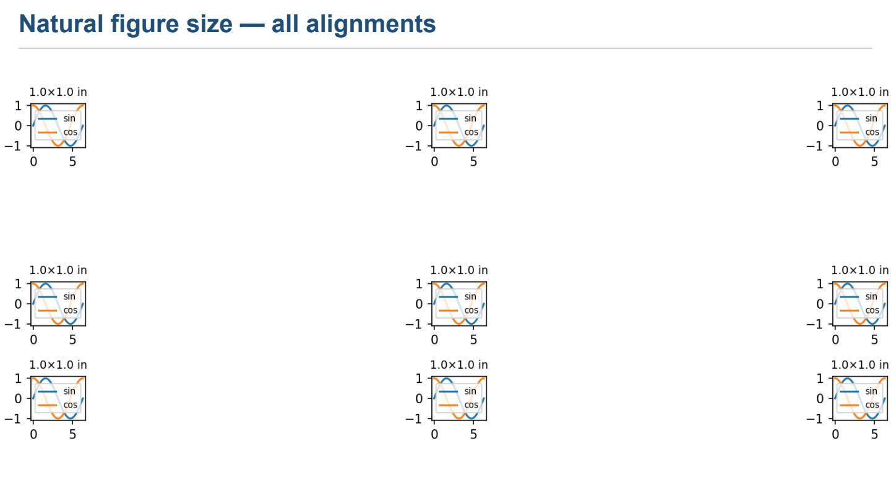
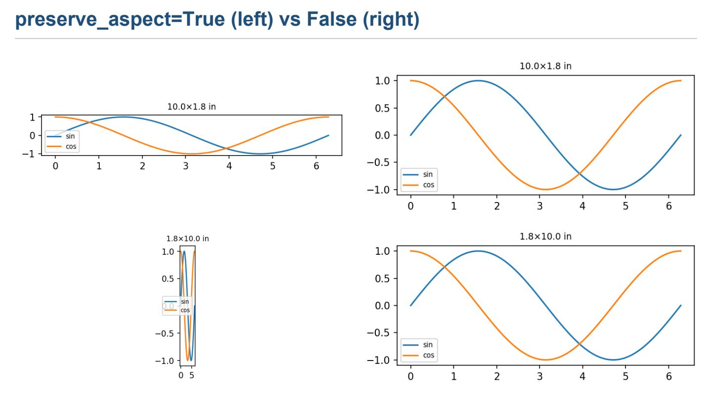
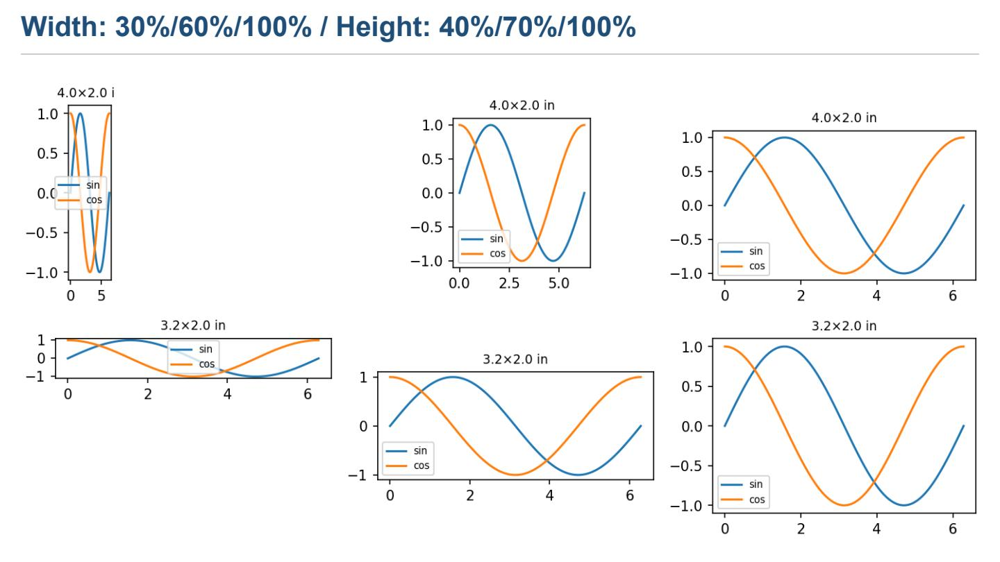
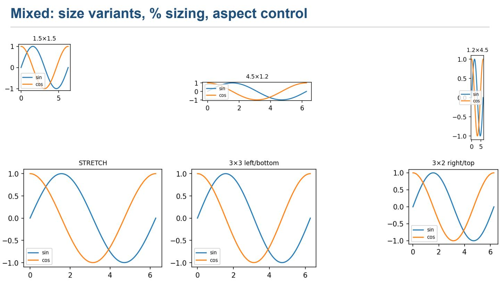

Figure alignment example
========================

Demonstrates how matplotlib figures interact with panel alignment,
``preserve_aspect``, ``container_width_pct``, and
``container_height_pct`` across 4 slides.

Usage::

    python examples/figure_alignment.py
    # → generates examples/figure_alignment.pdf

Imports
-------

.. code-block:: python

    from __future__ import annotations
    from pathlib import Path
    from reporting.document import Document
    from reporting.layout import Edges
    from reporting.slide import Slide
    from reporting.layout.panel import HAlign, VAlign
    from reporting.renderers.pdf.renderer import PDFRenderer

    import matplotlib
    matplotlib.use("Agg")
    import matplotlib.pyplot as plt
    import numpy as np

- ``matplotlib.use("Agg")`` — non-interactive backend (required on
  headless servers or CI).
- ``Edges`` — symmetric or per-side padding/margin.
- ``HAlign`` / ``VAlign`` — panel alignment enums used to position
  content inside each cell.

Helper — ``_figure()``
-----------------------

.. code-block:: python

    def _figure(figsize=(4, 2.5), title: str = "") -> plt.Figure:
        f, ax = plt.subplots(figsize=figsize)
        x = np.linspace(0, 2 * np.pi, 100)
        ax.plot(x, np.sin(x), label="sin")
        ax.plot(x, np.cos(x), label="cos")
        ax.set_title(title or f"{figsize[0]:.1f}×{figsize[1]:.1f} in", fontsize=9)
        ax.legend(fontsize=7)
        f.tight_layout(pad=0.3)
        return f

Returns a ``matplotlib.figure.Figure`` with a sin/cos plot.  The
``figsize`` controls the figure's *natural* size in inches; the
title shows the dimensions for easy visual identification.

Slide 1 — natural size × all alignments
----------------------------------------

.. code-block:: python

    s = Slide("Natural figure size — all alignments")
    s.grid_layout(rows=3, cols=3, gap=6)
    fig = _figure((3.2, 1.8), "3.2×1.8 in")

A 3×3 grid with a 6 px gap.  Every cell contains the same figure
but with a different ``(HAlign, VAlign)`` pair, showing how the
figure floats inside its cell when it is smaller than the cell.

.. code-block:: python

    alignments: list[tuple[HAlign, VAlign]] = [
        (HAlign.LEFT,   VAlign.MIDDLE), (HAlign.CENTER, VAlign.MIDDLE), (HAlign.RIGHT,  VAlign.MIDDLE),
        (HAlign.LEFT,   VAlign.BOTTOM), (HAlign.CENTER, VAlign.BOTTOM), (HAlign.RIGHT,  VAlign.BOTTOM),
        (HAlign.LEFT, VAlign.TOP), (HAlign.CENTER, VAlign.TOP), (HAlign.RIGHT, VAlign.TOP),
    ]

Every combination of the 3 horizontal × 3 vertical alignments:

- **Horizontal**: ``LEFT``, ``CENTER``, ``RIGHT``
- **Vertical**: ``TOP``, ``MIDDLE``, ``BOTTOM``

.. code-block:: python

    for idx, (ha, va) in enumerate(alignments):
        r, c = divmod(idx, 3)
        s[r, c].align(ha, va).plot(_figure((1, 1)))

``divmod(idx, 3)`` maps the flat index to row/column.
``.align(ha, va)`` sets the panel alignment *before* placing
the figure.  Each cell gets a fresh 1×1 in figure; because
the default ``preserve_aspect=False`` the figure stretches
to fill the cell, making alignment irrelevant in this case.

Slide 2 — preserve_aspect vs stretch
-------------------------------------

.. code-block:: python

    s2 = Slide("preserve_aspect=True  (left)  vs  False (right)")
    s2.grid_layout(rows=2, cols=2, gap=20,
                   padding=Edges(left=20, right=20, top=20, bottom=20))
    fig_wide = _figure((10.0, 1.8), "10.0×1.8 in")
    fig_tall = _figure((1.8, 10.0), "1.8×10.0 in")

A 2×2 grid with 20 px internal gap and 20 px outer padding.
Two extreme-aspect figures: very wide (10×1.8 in) and very
tall (1.8×10 in).

.. code-block:: python

    s2[0, 0].align(HAlign.STRETCH, VAlign.STRETCH).plot(fig_wide, preserve_aspect=True)
    s2[0, 1].align(HAlign.STRETCH, VAlign.STRETCH).plot(fig_wide, preserve_aspect=False)
    s2[1, 0].align(HAlign.STRETCH, VAlign.STRETCH).plot(fig_tall, preserve_aspect=True)
    s2[1, 1].align(HAlign.STRETCH, VAlign.STRETCH).plot(fig_tall, preserve_aspect=False)

All cells use ``HAlign.STRETCH`` / ``VAlign.STRETCH`` (fill the
cell).  The left column has ``preserve_aspect=True`` — the figure
keeps its aspect ratio and is centred inside the cell.  The right
column has ``preserve_aspect=False`` (the default) — the figure
stretches non-uniformly to fill the entire cell, distorting shapes.

Slide 3 — container_width_pct / container_height_pct
-----------------------------------------------------

.. code-block:: python

    s3 = Slide("Width: 30%/60%/100%  / Height: 40%/70%/100% ")
    s3.grid_layout(rows=2, cols=3, gap=8,
                   padding=Edges(left=20, right=20, top=20, bottom=20))

A 2×3 grid with padding and a small gap.  The example plays with
*container-relative* sizing — the figure's dimensions become a
percentage of the panel dimensions instead of the native ``figsize``.

**Row 0 — width variants:**

.. code-block:: python

    s3[0, 0].align(HAlign.LEFT, VAlign.TOP).plot(
        _figure((4, 2.0)), container_width_pct=30, container_height_pct=100)
    s3[0, 1].align(HAlign.CENTER, VAlign.MIDDLE).plot(
        _figure((4, 2.0)), container_width_pct=60)
    s3[0, 2].align(HAlign.RIGHT, VAlign.BOTTOM).plot(
        _figure((4, 2.0)), container_width_pct=100)

- ``container_width_pct=30`` → figure width = 30 % of panel width.
  Combined with ``HAlign.LEFT`` / ``VAlign.TOP`` — top-left anchored.
- ``container_width_pct=60`` → figure width = 60 % of panel width.
  ``HAlign.CENTER`` / ``VAlign.MIDDLE`` centres it exactly.
- ``container_width_pct=100`` → figure width = 100 % of panel width
  (fills the cell horizontally).  ``HAlign.RIGHT`` / ``VAlign.BOTTOM``
  has no visible effect because the content already fills the cell.

**Row 1 — height variants:**

.. code-block:: python

    s3[1, 0].align(HAlign.LEFT, VAlign.TOP).plot(
        _figure((3.2, 2.0)), container_height_pct=40)
    s3[1, 1].align(HAlign.CENTER, VAlign.MIDDLE).plot(
        _figure((3.2, 2.0)), container_height_pct=70)
    s3[1, 2].align(HAlign.RIGHT, VAlign.BOTTOM).plot(
        _figure((3.2, 2.0)), container_height_pct=100)

Same idea for the vertical axis: 40 %, 70 %, 100 % of panel height.
The width follows the figure's natural aspect ratio (no
``container_width_pct`` set, so width is the native matplotlib
width in points).

Slide 4 — mixed: sizes, percentages, and aspect control
--------------------------------------------------------

.. code-block:: python

    s4 = Slide("Mixed: size variants, % sizing, aspect control")
    s4.grid_layout(rows=2, cols=3, gap=8)
    s4[0, 0].align(HAlign.LEFT, VAlign.TOP).plot(
        _figure((1.5, 1.5), "1.5×1.5"), preserve_aspect=True,
    )
    s4[0, 1].align(HAlign.CENTER, VAlign.MIDDLE).plot(
        _figure((4.5, 1.2), "4.5×1.2"), container_width_pct=80, preserve_aspect=True,
    )
    s4[0, 2].align(HAlign.RIGHT, VAlign.BOTTOM).plot(
        _figure((1.2, 4.5), "1.2×4.5"), container_height_pct=90, preserve_aspect=True,
    )
    s4[1, 0].align(HAlign.STRETCH, VAlign.STRETCH).plot(
        _figure((2.0, 2.0), "STRETCH"), preserve_aspect=False,
    )
    s4[1, 1].align(HAlign.LEFT, VAlign.BOTTOM).plot(
        _figure((3.0, 3.0), "3×3 left/bottom"),
    )
    s4[1, 2].align(HAlign.RIGHT, VAlign.TOP).plot(
        _figure((3.0, 2.0), "3×2 right/top"), container_width_pct=70,
    )

Combines all the concepts:

- **Cell (0, 0)**: Small square figure (1.5×1.5 in), ``preserve_aspect``
  keeps it square, placed at top-left.
- **Cell (0, 1)**: Wide figure constrained to 80 % width with aspect
  preserved, centred.
- **Cell (0, 2)**: Tall figure constrained to 90 % height with aspect
  preserved, bottom-right anchored.
- **Cell (1, 0)**: Square ``STRETCH`` with ``preserve_aspect=False``
  — fills the cell completely.
- **Cell (1, 1)**: 3×3 in figure, natural size, left/bottom anchored.
- **Cell (1, 2)**: 3×2 in figure, 70 % panel width, right/top anchored.

Rendering
---------

.. code-block:: python

    out = Path(__file__).parent / "figure_alignment"
    PDFRenderer().render_document(doc, str(out) + ".pdf")
    print("OK")

Writes the PDF to ``examples/figure_alignment.pdf``.
