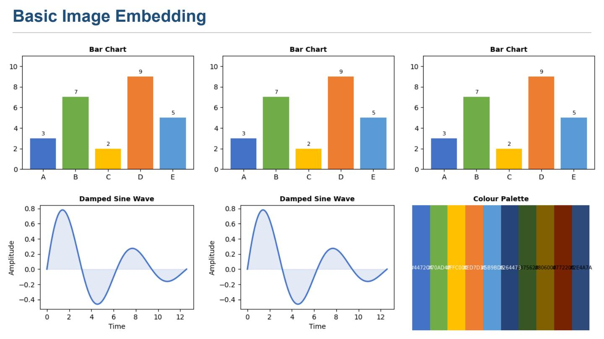
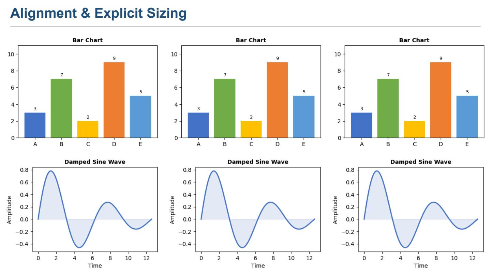
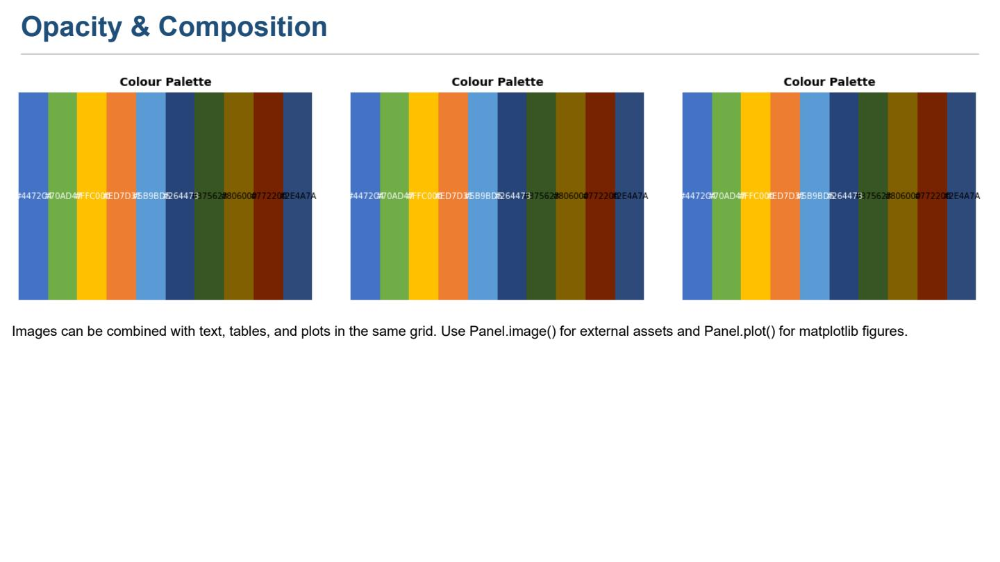

Image embedding demo
====================

``examples/image_demo.py`` demonstrates embedding external raster images
(PNG/JPG) via ``Panel.image()``.

.. code-block:: bash

   python examples/image_demo.py

The example generates three test images using matplotlib (a bar chart, a
damped sine wave, and a colour palette), then embeds them across three
slides.

Slide 1 — Basic image embedding
--------------------------------

Shows the available ``fit_mode`` and scaling options:

- **Original size** — native dimensions from the file
- **Scale 0.5 / 1.5** — uniform scale factor applied to width and height
- **Fit vertical** — ``ImageFitMode.FIT_VERTICAL`` fills the cell height,
  width follows aspect ratio
- **Fit horizontal** — ``ImageFitMode.FIT_HORIZONTAL`` fills the cell width,
  height follows aspect ratio
- **Rotation 45°** — 45-degree rotation around the image centre

Slide 2 — Alignment & explicit sizing
--------------------------------------

Demonstrates positioning via panel alignment and fixed dimensions:

- **Left/Top**, **Center/Middle**, **Right/Bottom** — panel alignment
  combined with ``scale=0.6``
- **Width=120pt** — fixed width, auto height
- **Height=80pt** — fixed height, auto width
- **Width=150, Height=60** — explicit width and height (aspect may distort)

Slide 3 — Opacity & composition
--------------------------------

Shows the ``opacity`` parameter (0.0–1.0) and a text-only cell:

- **Opacity 0.3 / 0.6 / 1.0** — opacity values applied during rendering
- **Text cell** — images can share a grid with text, tables, and plots

