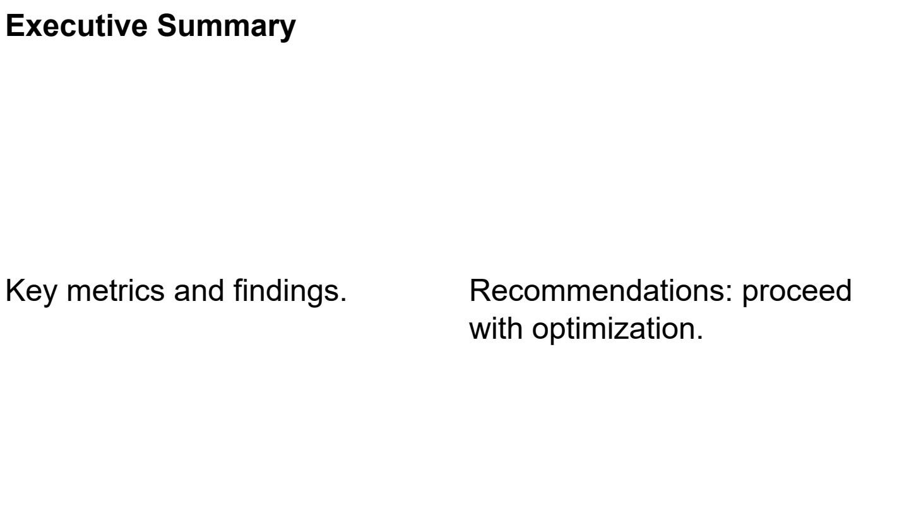

Quickstart
==========

Install and dependencies
------------------------

.. code-block:: bash

   pip install -e ".[dev]"

Minimal example
---------------

Create a single-slide report with a grid layout:

.. code-block:: python

   from reporting.document import Document
   from reporting.slide import Slide
   from reporting.layout.geometry import Edges
   from reporting.renderers.pdf.renderer import PDFRenderer

   doc = Document(title="My Report")

   slide = Slide(title="First Slide")
   slide.grid_layout(rows=2, cols=2, gap=8, padding=Edges.all(15))

   slide[0, 0].text("Hello", bold=True, size=14)
   slide[0, 1].text("World", color="#C62828")
   slide[1, :].text("Spanning row", size=10, font_name="Times-Roman")

   doc.add_slide(slide)

   PDFRenderer().render_document(doc, "output.pdf")

What each piece does
--------------------

1. ``Document("My Report")`` — creates a report container
2. ``Slide("First Slide")`` — creates a page with a built-in title panel (60px)
3. ``slide.grid_layout(rows=2, cols=2, gap=8, padding=Edges.all(15))`` — arranges
   a 2×2 grid with 8px gaps and 15px padding around the edges
4. ``slide[row, col]`` — NumPy-style cell access; returns a ``_CellProxy``
5. ``.text("...", bold=True, size=14, color="...", font_name="...")`` —
   creates a ``TextElement`` with formatting applied
6. ``doc.add_slide(slide)`` — appends the slide to the document
7. ``PDFRenderer().render_document(doc, "output.pdf")`` — renders to PDF

Adding a plot
-------------

.. code-block:: python

   import matplotlib.pyplot as plt
   import numpy as np

   fig, ax = plt.subplots()
   ax.plot(np.linspace(0, 10, 50), np.sin(np.linspace(0, 10, 50)))
   slide[0, 0].plot(fig)

Adding a table
--------------

.. code-block:: python

   import pandas as pd

   df = pd.DataFrame({"A": [1, 2], "B": [3, 4]})
   slide[1, :].table(df, zebra=True)

Adding an image
---------------

.. code-block:: python

   slide[0, 0].image("path/to/image.png")

Renderers
---------

.. code-block:: python

   from reporting.renderers.pdf.renderer import PDFRenderer
   PDFRenderer().render_document(doc, "report.pdf")
   HTMLRenderer().render_document(doc, "report.html")

Example output
--------------

