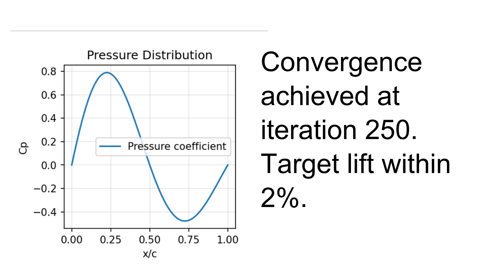

Renderers
=========

All renderers implement the ``BaseRenderer`` ABC with three methods:
``render_document``, ``render_slide``, ``render_panel``.

PDFRenderer
-----------

Generates a PDF file using ReportLab with absolute positioning within each
grid cell.

.. code-block:: python

   from reporting.renderers.pdf.renderer import PDFRenderer

   PDFRenderer().render_document(doc, "output.pdf")

The PDF renderer:

- Draws the title panel at the top of each slide
- Renders panel background colors as filled rectangles
- Uses ``canvas.Canvas`` with absolute pixel-to-point conversion
- Embeds figures as PNG images via temporary files
- Handles ````, ``<b>``, ``<i>``, ```` tags
  in text via ReportLab's Paragraph
- Clips table content inside cell boundaries via ``Frame.addFromList()``

Font names for PDF must be PostScript names: ``Helvetica``, ``Times-Roman``,
``Times-Bold``, ``Courier``, ``Courier-Bold``, ``Helvetica-Oblique``, etc.

(PPTX renderer has been removed.)

HTMLRenderer
------------

Generates an HTML file (standalone by default) with CSS styling.

.. code-block:: python

   from reporting.renderers.html.renderer import HTMLRenderer

   HTMLRenderer().render_document(doc, "output.html")     # standalone
   HTMLRenderer(standalone=False).render_document(doc, "output.html")  # fragments

The HTML renderer:

- Generates a full HTML5 document with embedded CSS
- Uses absolute positioning (px) for each cell via ``position: absolute``
- Embeds figures as base64-encoded PNG images
- Renders tables with border-collapse styling
- Supports nested containers recursively
